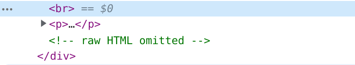

By default Hugo, a static site generator, will remove raw html from markdown files.

The removed html gets replaced with a comment.



In fact, such a comment exists in the page you are viewing right now, created by a dummy ``<script>`` tag.

<script>;</script>

# Shortcodes

[A Shortcodes](https://gohugo.io/content-management/shortcodes/) is a short snippet of html inserted into a page by a marker like ``{{ shortcode }}``

These can be used for things like embedding a youtube video.

Shortcodes can wrap both markdown ( ``{} markdown {}`` ) and raw html (`` html ``).

A dummy shortcode that just returns the wrapped html would allow including raw html.

# The rawhtml shortcode

Shortcodes are stored in the ``layouts/shortcodes/`` directory.

To add a rawhtml shortcode, create the file ``layouts/shortcodes/rawhtml.html`` (at the root of your site or theme) with the following html:

```html
<!-- raw html -->
{{.Inner}}
```

To use it, just wrap the html with ``{{ < rawhtml > }}`` and ``{{ < /rawhtml > }}``.



<b>This is raw html <s>Strikeout</s></b>



# Escaping shortcode

If you add '/*' after the '{{' and a '*/' before the '}}', the shortcode literal will be inserted into the document.

```

```

will produce:


