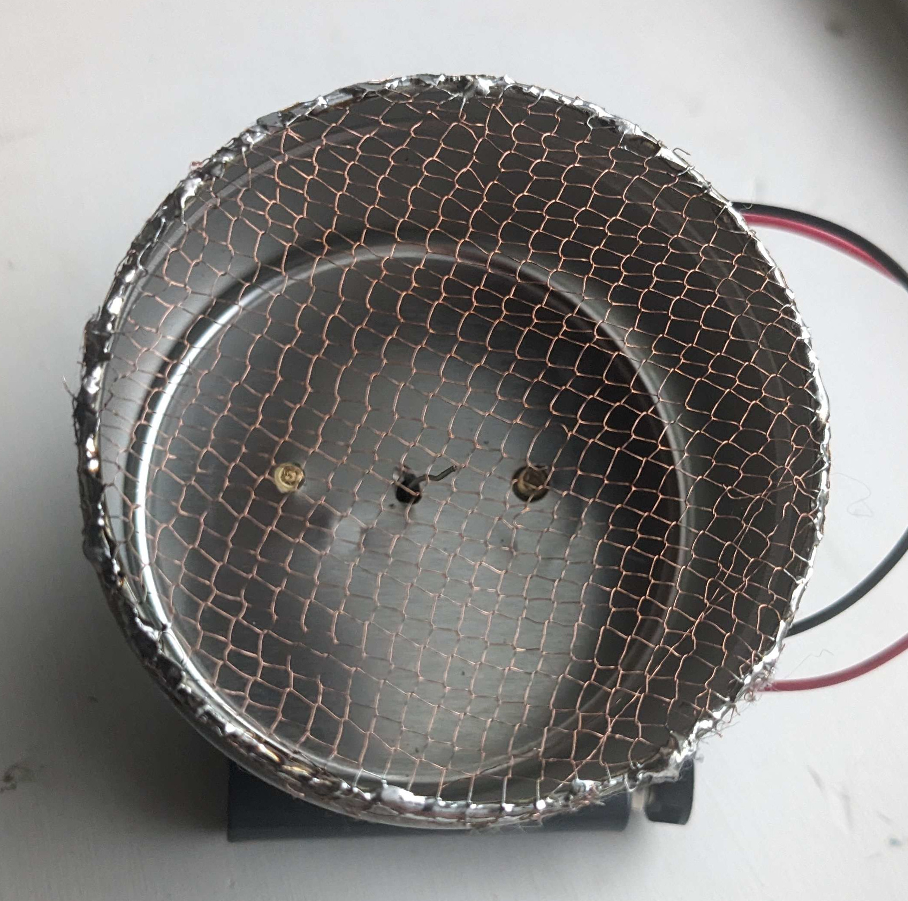
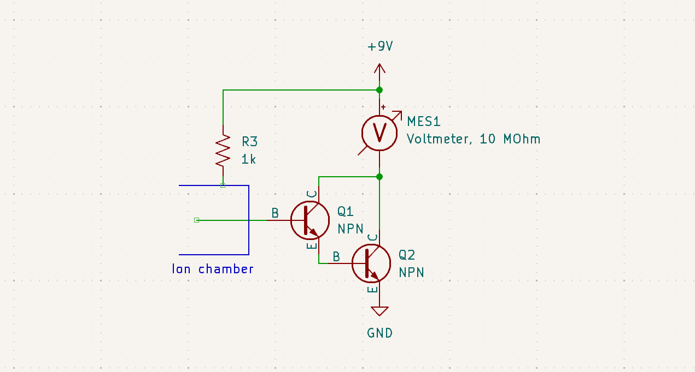
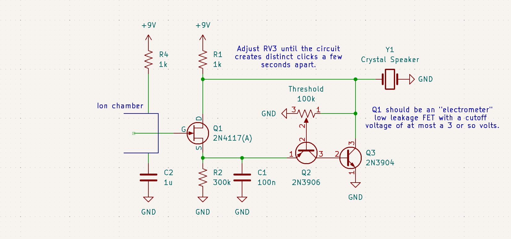
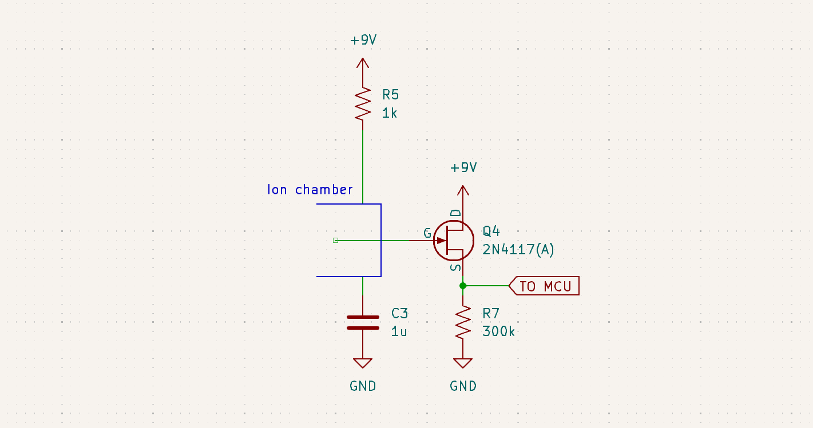

To build an ion chamber, I soldered some wire to a small steel can as one electrode, drilled a hole and inserted another wire as the other electrode.
I then covered the opening with a metal mesh to keep out static and stray fingers.
Aluminum foil can be used for better shielding from static electricity, but at the cost of blocking alpha particles from entering[^foil]:

Larger cans will work fine, and will be more sensitive to beta and gamma.

When radiation enters the chamber, it ionizes some of the air inside, allowing a tiny, often sub-picoamp current to flow between the electrodes.

Air filled ion chambers are very sensitive to alpha, somewhat sensitive to beta but have fairly little gamma response.
Beta and gamma response can be improved by using a larger chamber, or by filling it with pressurized gas, but doing this adds a quite lot of complexity.

**The main gotcha is that many "insulators" like PVC wire insulation, rosin flux, and glue are actually quite conductive down at the picoamp level.**
I left the base leads floating in the air and glued the Q1 to the can, making sure no glue touched the leads.
For larger chambers, plastic (polystyrene) beads work well as stand-offs and feed-throughs.
Glue the wire into the bead's center, and glue the bead into the can, but avoid bridging the can and wire with glue.

# Amplification:

I did not have a meter able to directly measure the picoamp[^picoamps] level ionization current, but a few transistors was enough to fix that:

Use small signal transistors, power ones will have too much leakage.

The Darlington pair provides a gain of around 30,000, but the real trick is using a multimeter on voltage mode.
That way the meter's 10 megaohm impedance acts as a current shunt, allowing it to measure the feeble current.
The 1k resistor protects the transistors in the case of a short between the 2 chamber electrodes.
Voltage is not critical, but going over around 10 volts massively increases leakage with my transistors.

There is not much to love with this circuit, it is not very sensitive, and the gain and leakage current drift wildly with temperature, but it does work well enough to highlight some to weird properties of alpha radiation:

My circuit is saturated by a 1 uCi (37 kBq) Am-241 source at 3 cm away, but at 4 cm the reading drops to near background.
This is because alphas are very good at ionizing air, and lose energy at a consistent 1.3 MeV per cm, and generating around 35,000 ion pairs in the process.

Because of this, I had to make a proper alpha attenuator to compare the sensitivity of different circuits.
To do this I cut a small .5 x .5 millimetre aperture in an aluminum foil shield over the chamber, the resulting attenuation depends on how close the source is to the aperture:

|Distance from source:&nbsp;&nbsp;&nbsp;|Attenuation factor:&nbsp;&nbsp;&nbsp;|Alphas from 1 uCi Am-241:|
|-|-|-|
|2 mm|0.001|60 per second|
|5 mm|0.0002|9 per second|
|10 mm|0.00006|2 per second|
|15 mm|0.00003|1 per second|
|20 mm|0.000015|.5 per second|

Just 2 millimetres of distance gets the 1 uCi of Am-241 to the detection threshold of the simple Darlington circuit.

# The power of time:

Instead of trying to amplify the tiny, sub-picoamp ionization current, it is easier to accumulate the charge for some time and measure the resulting voltage.
I used a JFET to collect the current, because the the gate can be discharged by pulling the drain or source low, avoiding the need for a separate low leakage switch. 
JFETs can also just a few picofarads of gate capacitance, so the tiny current will quickly create quite a significant voltage.

This will work with most JFETs, but a good low gate leakage, low gate capacitance JFET like the PN4117(A) will work a lot better.
These FETs will probably continue to be available because they are the best technology for electrometers and similar devices.

I built up a fairly simple circuit can discharge the FET once the gate reaches a certain voltage, converting the current into a frequency modulated pulse train:

The JFET functions as a source follower, buffering the signal from the ion chamber into C1.
Once C1's voltage rises above a set threshold, Q5 and Q6 short C1 and the FET's drain to ground, discharging the gate trough the FET's intrinsic diode.
Additionally, this creates a click from the piezoelectric disk, creating quite a nice Geiger counter style audio indication.

If set to around 1 or 2 clicks per second this circuit is sensitive enough to enough to detect a single alpha particle as a sharp increase in click rate that lasts for a second or two.
My small chamber detects a background of 2 particles per minute, but this will vary depending on the amount of radon in your air.

The circuit is still not perfect, the threshold is temperature sensitive, and the short reset pulses are not quite enough to fully discharge the FET.
This creates a a far higher pulse rate background then just FET leakage alone when the circuit is set to frequently click.

Both of these can be avoided by simply using a microcontrollers to handle the whole operation:

The microcontroler should momentarily pull the source low to discharge the FET, and then after a few seconds measure the source voltage with it's ADC.
With a long integration time, a microcontroler can measure very small amounts of radiation, as well as calibrate out leakage current. [^leak]

[^picoamps]: Less then 10^-12 of an amp. That's 6 digits below 1 microamp. 

[^foil]: Of course, if the source is placed inside the chamber, or is in the air like radon, the window material doesn't matter.

[^leak]: 
	Importantly the leakage current is not constant, for my FET, the leakage drops drastically above 3 V at the source.
	It might help to use a separate pin with a zener diode in series for discharging, to bring the reset voltage up.
