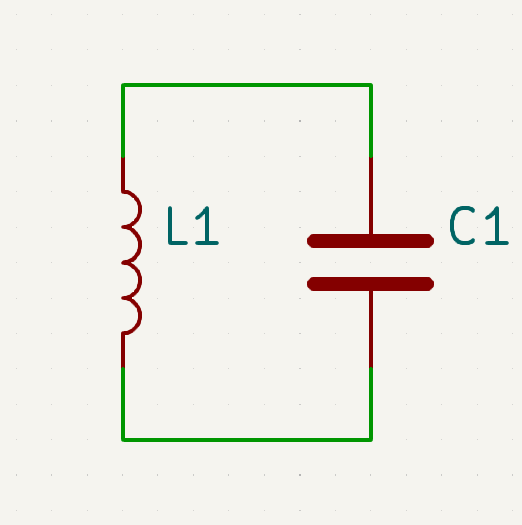
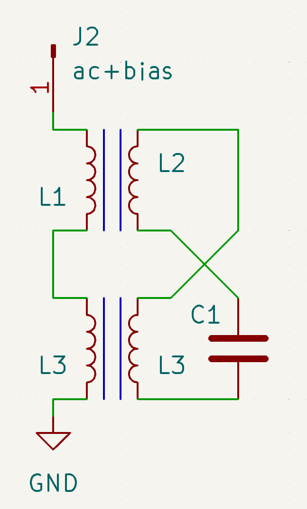
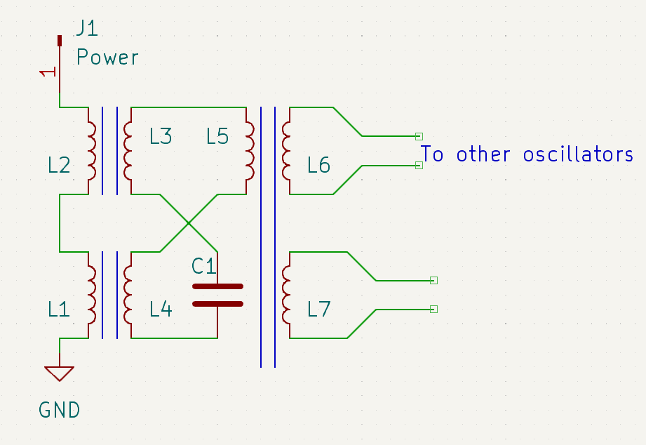
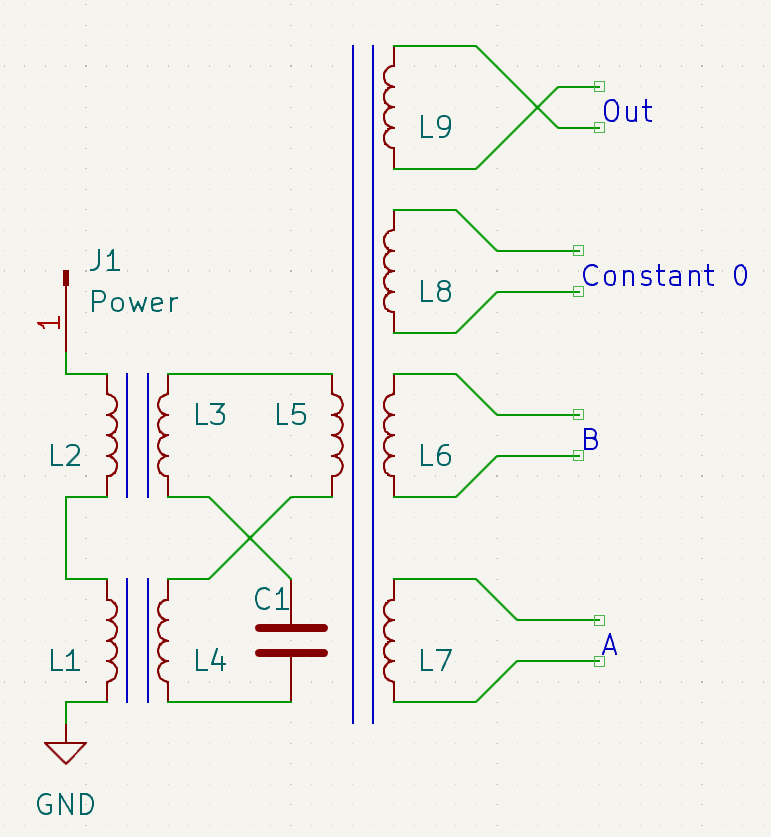
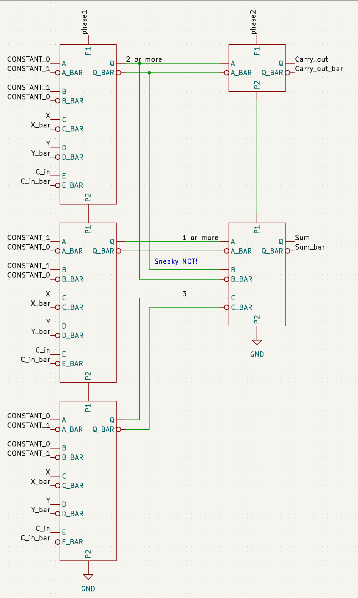

The normal way to get an LC tank circuit to oscillate is by using an amplifier to apply positive feedback.
However, it can also oscillate if the inductance or capacitance is changed at twice the resonant frequency (parametric oscillation). [^0]
(This is going somewhere, I promise)

The capacitance can be changed using a varactor diode, but,  more exotically the inductance can be changed by driving the core into saturation with another winding:

Note the flipped polarity on one of the transformers, this prevents the driving signal from directly coupling to the tank.

If a DC bias current[^1] and AC current at twice the resonant frequency (The bias current will change the inductance, play around with the bias and frequency) is applied, it will excite an oscillation at the resonant frequency.
Interestingly, if multiple such oscillators are on same supply, they can be either in phase, or 180° out of phase, and stay locked in that phase relationship as long as power is applied.

Things get more interesting if you couple multiple together: (One turn of wire on a core is enough here, they don't have to be strongly coupled)

Now if one is oscillating, it will induce a small signal in all connected oscillators, that when power[^2] is applied will be amplified to a large oscillation.
So if an odd number of other oscillators are coupled in, the phase of the resulting oscillation will be the phase of the majority of the inputs.

This is starting to look like a logic gate, but is missing a phase reference.
Phase shifts are relative, so a reference oscillator is needed, and can just be a oscillator with that is always powered and therefore stays in the same phase.
This oscillator has to be shared by the whole system, and can also be used as a constant zero or one.

A majority gate seems a bit exotic, but a 3-input one can actually emulate a standard 2-input AND if one of the inputs is a constant zero.
(OR is the same but with a constant one)
Inverting a signal is quite easy, by swapping the two wires, creating a 180° phase shift, and giving a NAND/NOR gate:

Finally, something useful!

Powering/Clocking is a bit tricky, because not only do the gates have to be power cycled to change state, but the inputs/outputs are bidirectional, an output *will* function as an input if given the chance.
Any logic circuit can actually be implemented with 3 just power/clock lines, powered in the following sequence: 1, 1+2, 2, 2+3, 3, 3+1.
The works as long as each gate's inputs are from gates on previous power/clock line, and it's outputs are always on the next.
This does end up requiring some dummy 1 input buffer "gates", but it can work.

Majority gates are actually quite nice for some more complex logic, because they can intrinsically "count" the number of 1s and 0s.
For example, in a full adder, the carry out can be computed with just a single 5 input gate, with the 3 inputs to the adder, and a constant zero and one.
The output will be one if 2 or more of the inputs are.

The rest of the adder is a bit harder, but this diagram makes it look a lot more complex then it actually is because it shows the differential signals as separate wires:

This adder takes just 15 cores, which is a surprisingly reasonable amount for such a weird form of logic.
It also just uses 2 of the 3 clock lines, the third could be used to implement an accumulator, or a shift register to add multi-bit numbers.

This type of logic has actually been used in some historical computers such as the Fujitsu FACOM 201 and the MUSASINO-1, because a bunch of cores was cheaper then the equivalent amount of  vacuum tubes/transistors, and just as reliable.
These computers did use some tubes to generate the high frequency AC needed, switch the clock lines, as well as some assorted circuitry, like core memory drivers and sense amplifiers, but were using parametric oscillators for the logic.[^3]

[^0]: Interestingly, this is used for [extremely low noise amplifiers and oscillators](https://en.wikipedia.org/wiki/Parametric_oscillator), because inductors and capacitors, unlike resistors and transistors don't generate noise.

[^1]: 
	Quite a large current, even for small cores. For the small 3mm (Fair-Rite 43) ferrite cores I used, it took .5 amps of current (but just 0.001 V, determined by wire resistance)
	Sure I only used one turn for biasing and power to make assembly easier, and  with 5 turns it would have taken just .1 amps to saturate the core.
	
	I recomend testing using a seperate winding (1 turn is fine) for bias and AC in, so that a function generator can be used for the AC, and a standard power supply can be used for bias.

[^2]:
	With separate bias and AC input windings, just switching one on and off is fine.

[^3]:
	A miniturized version of this using quantum effects called the ["Quantum flux parametron"](https://en.wikipedia.org/wiki/Quantum_flux_parametron) has gotten a some recent attention for high speed and super low power logic, but requires to be impractically cold to function.
	At large scales, the high power efficeny might outweigh the costs of cooling the device, but this technology has yet to be demostrated on scales larger then a 12 bit adder.
