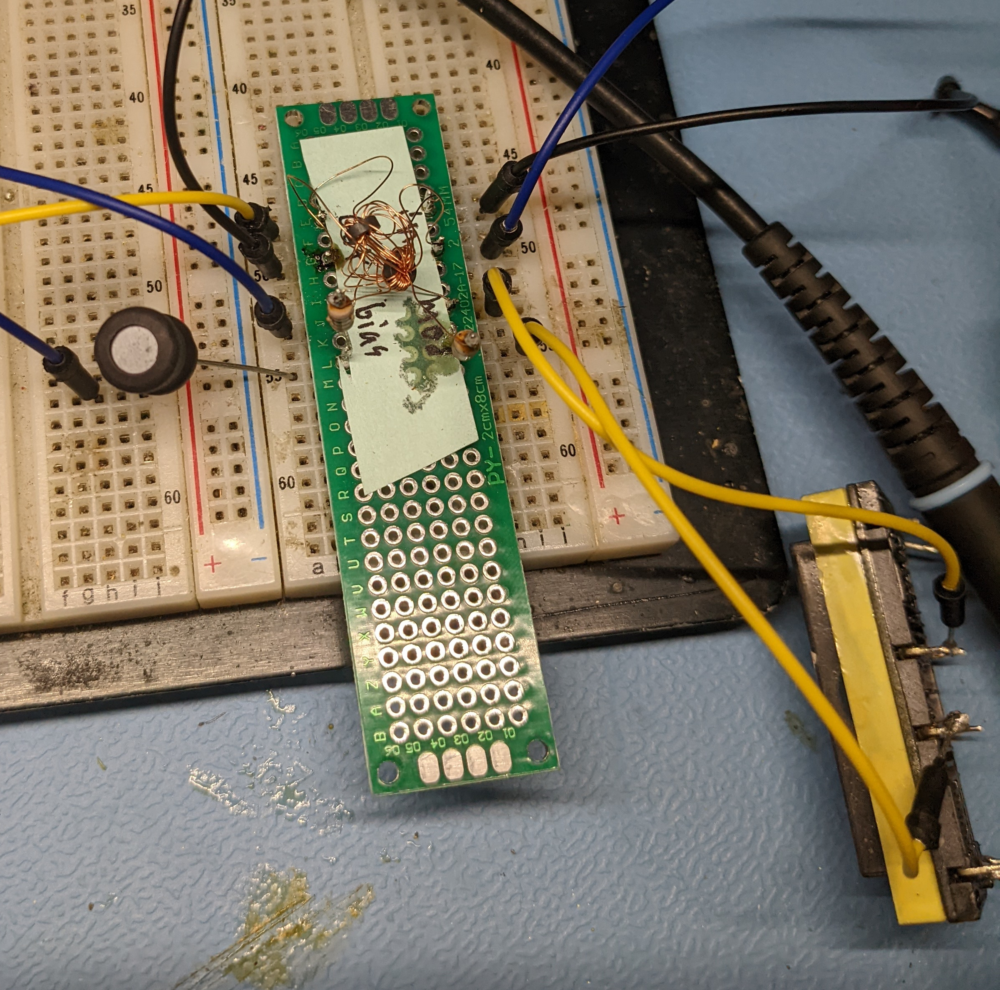
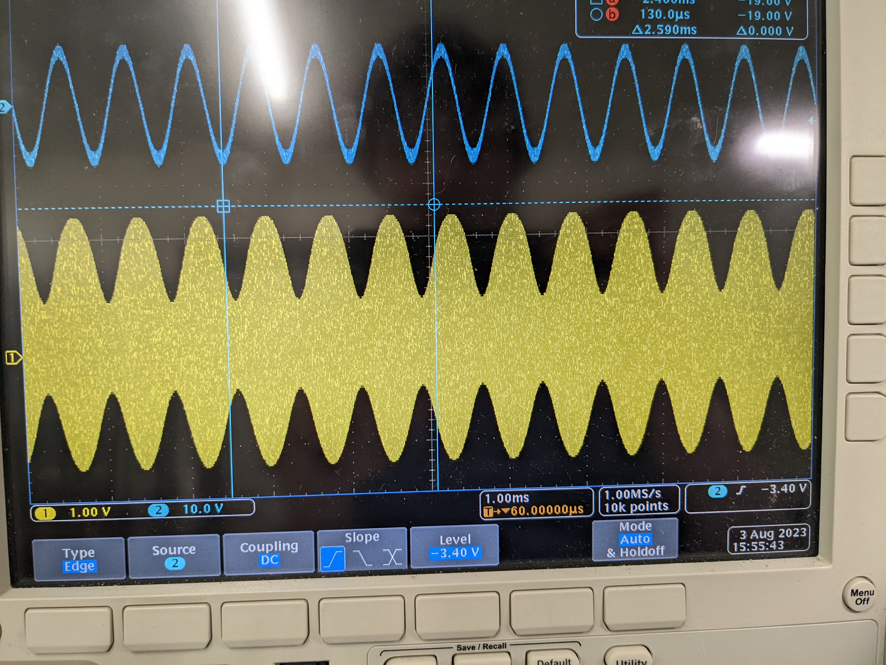
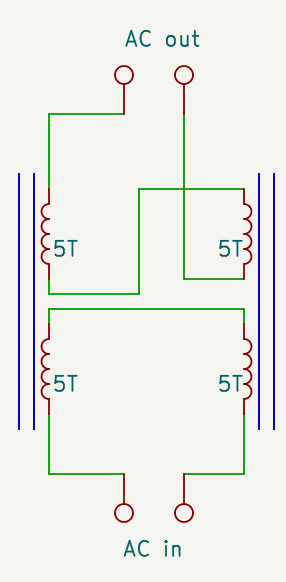
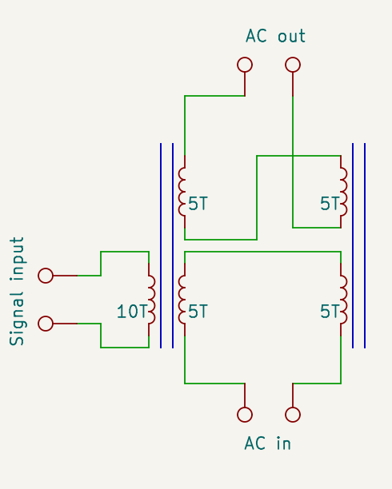
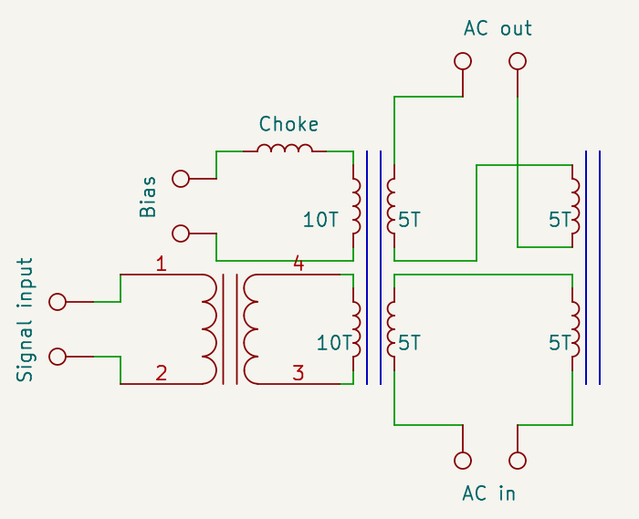

This is a functional AM modulator (and with the help of a rectifier, an amplifier) built entirely out of transformers and inductors:

(It does not look like there is gain here, because of the different impedance's, but this does actually produce a stronger output signal than the modulating input.)

How is this possible without any transistors, vacuum tubes, or even diodes?

Ferrite and iron cored inductors and transformers exhibit *core saturation*, where once a certain amount of magnetic field is flowing through the core, it becomes much harder to pass more through it.
In the case of a transformer, this results in in sharp drop in coupling between windings once the current (creating a magnetic field) reaches a certain point.

This gets more interesting with 2 matching transformers, connected so that the signal coupled by one is perfectly canceled out by the other:

Normally almost no AC passes to the output, as any voltage induced by one transformer is canceled out by the other.
However, if one of the transformers is worse at coupling AC, for instance if the core saturated, then AC will be able to pass through, as the two voltages no longer perfectly cancel out.
Saturating just one of the transformers requires adding an additional winding:

When enough DC is present on the control winding that the transformer saturates (for at least part of the AC cycle), then AC *will* be passed through to the output.
This allows a small DC current to control a larger AC current, with no moving parts.

To make this into a AM modulator requires only a few changes: adding an audio transformer on the input, and adding a 4th bias winding:

The audio transformer is necessary becuase saturating the core, with the low turn count I used, takes quite a bit of current, but not much voltage.
A transformer meant for audio use also presents a large inductance at RF, which stops RF coupling into the audio source, which could not only damage it, but also would also mess up the balance between the other two transformers.

The bias winding serves to keep the core close to saturation during all parts of the audio signal, this not only increases the modulation depth, but also minimizes distortion.
The inductor in series with the bias winding keeps RF out of the bias power supply, which could otherwise mess up the balance between the two RF transformers.

I used a small 6mm ferrite core to wind the RF transformers, because a small core will saturate at a low current (in my case it saturates with around 400 mA in the bias coil), and a 100mH inductor as a choke on the bias.

If combined with a rectifier on the output, this type of setup can produce usable gain, in my case it achieved a power gain of around 2 (a much better gain is possible with a better setup, or multiple stages). 

Historical, much larger versions of this system were used to switch hundreds of kilowatts of RF in early Alexanderson alternator based transmitters, and later to generate high power AM signals. 

While for amplification and modulation, core saturation based systems are almost fully replaced by transistor based systems, but one application remains: High power current regulation.
In applications like arc welding, a huge amount of current (hundreds of amps) has to be controlled.
The simplest way to do this is by placing one winding of a transformer in series with the load (the arc in this case), and applying a small DC current to saturate the core.
Once saturated, the inductance of the winding drops, allowing much more current to flow then could otherwise.
(This works because the control side has more wingdings, so comparatively small current will saturate the core) 
