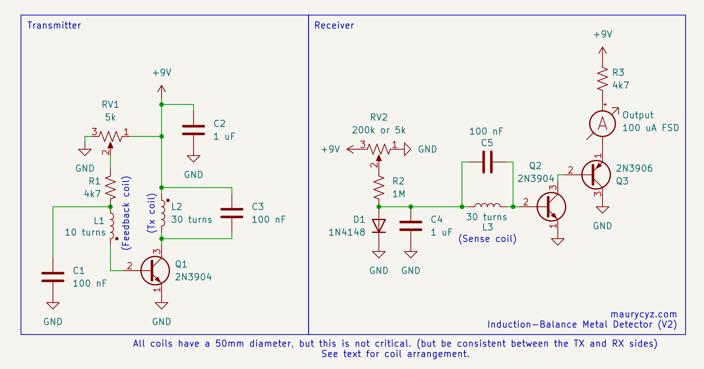
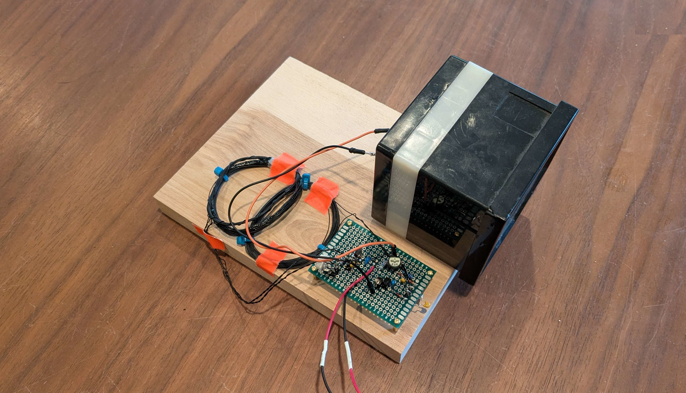
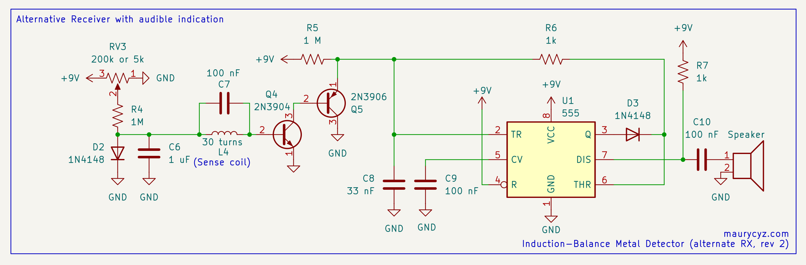

This certainly isn't the best metal detector design,
but with just 18 components, it's a fun thing you can quickly put together:

<!-- Schematic -->

<!-- Circuit -->

The circuit is really just an oscillator and a radio receiver, all the magic is in the coils. 
The feedback coil should be placed on top of the transmit coil, and the sense coil should be offset from both:

<!-- Coil layout -->

> 
It helps to bend the coils into the classic "Double D" shape

<!-- Coil construction -->

Magnetic field lines are always closed loops, so the magnetic field around a coil has the opposite polarity as the field inside a coil. 
The offset sense coil feels the same amount of flux inside the transmit coil as the flux outside of the coil, which cancels out any induced current. 

... at least until some metal gets close to the coils. 
The field from the transmit coil will induce eddy currents the metal, and those currents will create their own magnetic field. 
This new magnetic field induces a current in the sense coil, which is detected by the receiver. 

This does need careful adjustment to work, here's how:

1. Set RV1 to the lowest voltage, this will prevent the oscillator from starting. 
2. Apply power to the circuit.
3. Adjust RV2 until the meter needle is near (but not at) the bottom of it's range.
4. Turn RV1 until the oscillator stars, probably maxing out the meter.
5. Slide the sense coil around to the position that gives the lowest reading
6. Null the meter with RV2.

It helps to leave a free loop of wire in one of the coils for fine adjustments. 

If the oscillator doesn't start during step 4, try reversing the polarity of the feedback coil.

<!-- Pictures -->

> 
... but perhaps don't leave the diode hanging off the board like that, it'll cause drift. It's fine with a meter but is annoying with a speaker.

<!-- Results -->
Using 5 cm coils, the circuit was able to detect a US quarter from 9 cm (3.5 inches), and a 12 oz soda can from 18 cm (7 inches).

As drawn, the detector operates at 50 kHz, which is rather high as metal detectors go. 
You may want to try adding more turns to the coils or additional capacitance to C1 and C3 to reduce it depending on your application.

For treasure hunting, you may want to replace the meter with a speaker: 

> 
Note: The 555's pins are arranged differently then shown on the diagram.

For best sensitivity, set RV3 (same as RV2 in the normal circuit) to right before it starts buzzing.
Because of thermal drift, you'll probably be adjusting it quite often, so a nice knob wouldn't be out of place.
