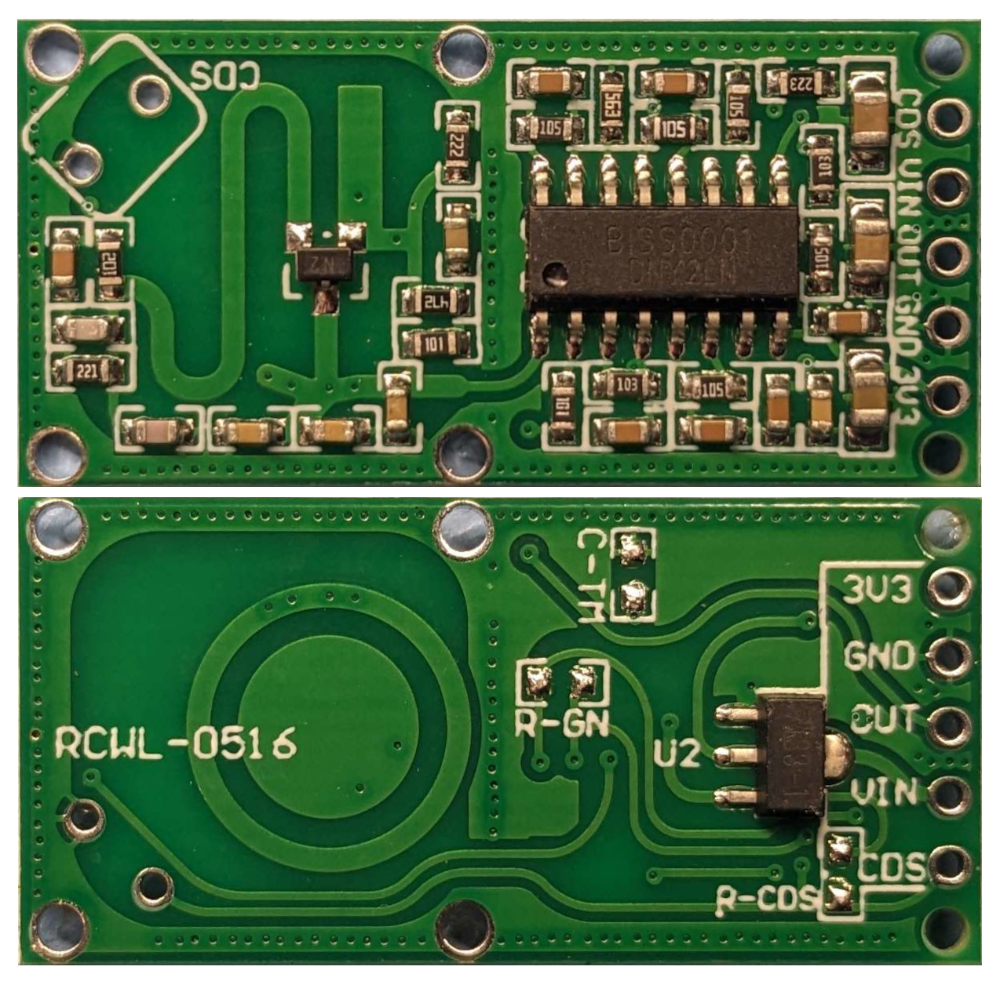
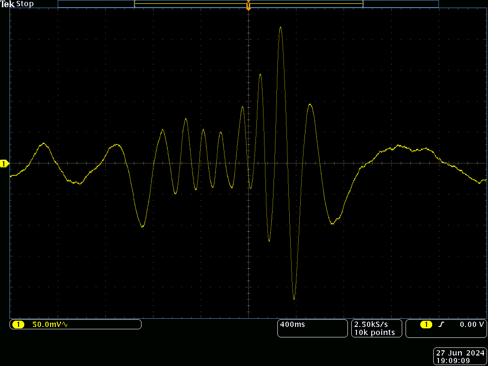
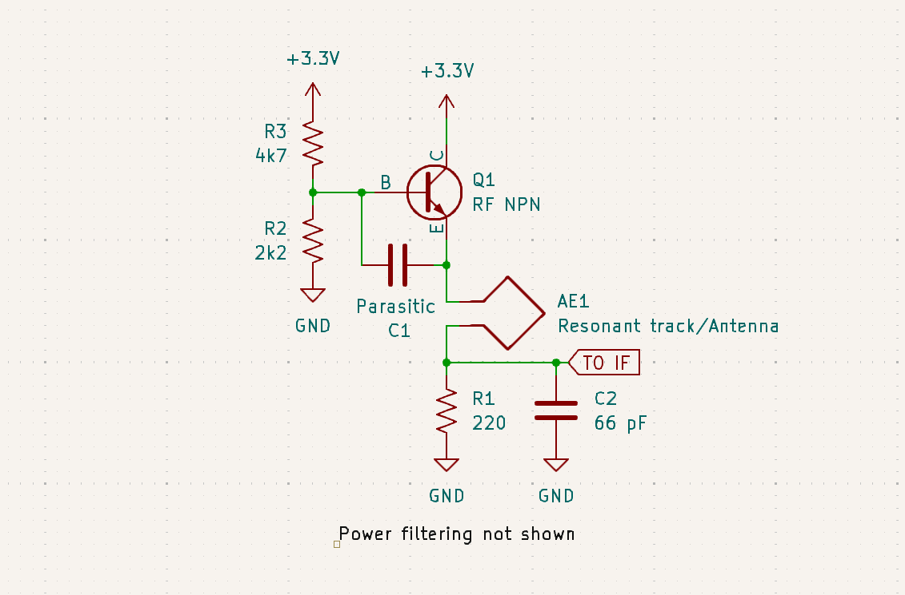
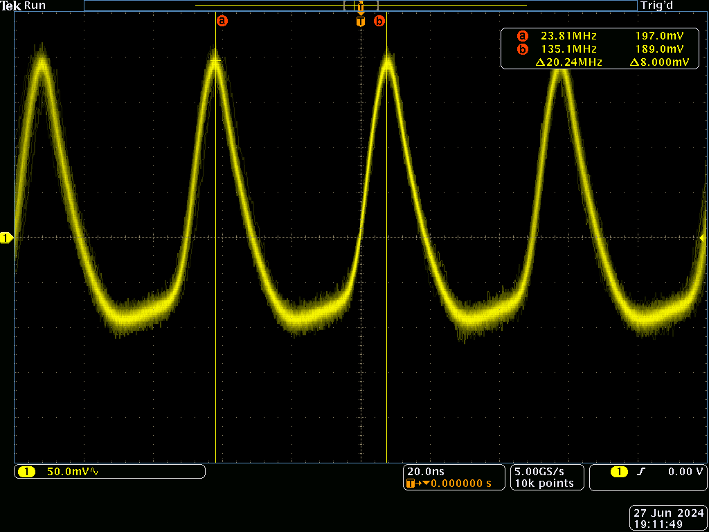
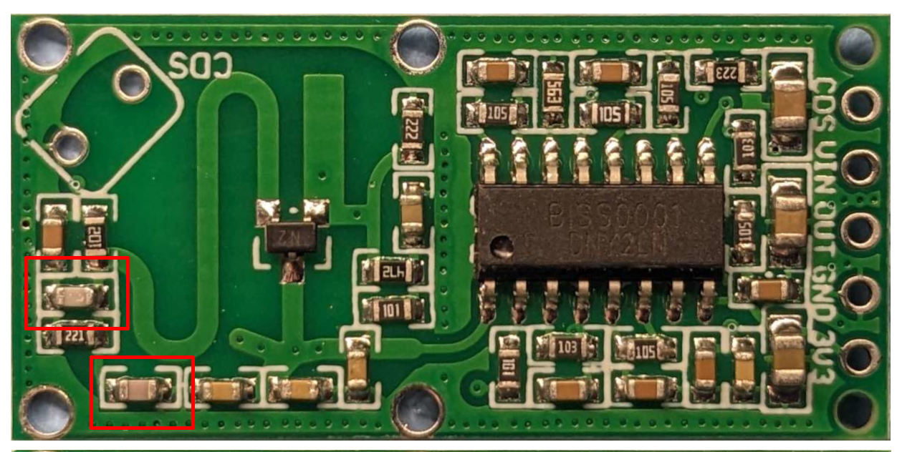
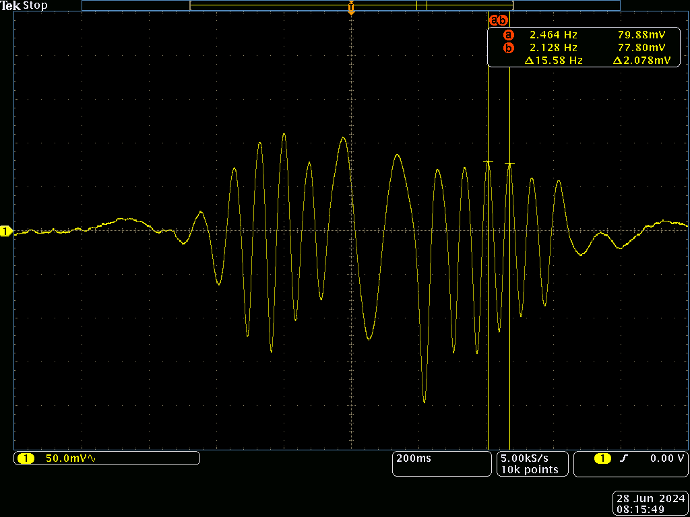

I recently got some cheap RCWL-0516 microwave motion sensors, mostly because I was wondering how China managed to make a radar for under a dollar:

[ Click for mirrored back view](boardrev.png)

Getting one working was quite easy, I just connected the `VIN` pin to 5 volts, `GND` to ground, and added a 1 uF decoupling capacitor on the `3V3` pin.
When someone moves within ~5 meters, the `OUT` pin goes up to 3 volts for 3 seconds. 

So it works, but how?

First, I found a datasheet for the the large SOIC-16 chip.
It turns out the `BISS0001` is an *infrared* motion sensor chip? How does that work?

Generally, motion and speed sensing (doppler) radars work by sending out a continuous carrier and mixing the received signal with the transmitted carrier to create a low frequency IF signal.
If reflections are coming from a moving object, the received signal will slowly drift in and out of phase with the transmitted signal, creating a beat frequency at just a few hertz.
Becuase a motion sensor doesn't care about the exact speed, all the chip has to do is look for millivolt-level changes: all the hard work is already done.

In my module, the IF signal enters the chip on pin 14, but the chip outputs an amplified copy on pin 16, which is much more oscilloscope friendly:[^biss]



In the middle of the trace I moved a laptop ~40 centimeters towards the sensor, but the sensor also picked up some slower level shifts on either side from when I reached over to stop the scope.
This trace is actually enough to figure out what the frequency the radar is using: While the laptop was moving, there were 8 peaks, meaning that the round trip path length changed by 8 wavelengths.
Eight wavelengths over a distance of 80 cm comes out to ~10 cm, not that far from the actual wavelength of 9.4 cm.

# So where's all the magic?

The entire right side of the board is just the BISS001 acting as an amplifier, comparator and timer.
All of the RF stuff happens on the left side of the board using just a handful of components:


At first glance, the whole thing is just a single transistor oscillator working at a frequency of 3.18 GHz:



The S shaped track on the emitter is a microwave resonator[^resonator] and antenna, which is driven by the BJT transistor with feedback from a capacitor formed by the resonator and a parallel copper track.
I suspect the ring structure at the back is just to prevent oscillation at other frequencies, many very similar sensors don't have one, or just use a solid ground plane.
The oscillator is also quite unstable, and drifts by several MHz from hand capacitance and biasing drift, which is likely why the module is quite sensitive to power supply noise.

But it's actually 2 oscillators in one, the microwave oscillation is pulsed at around 20 MHz, creating this waveform on the emitter:


My scope can't see 3 GHz, but it's there everywhere except on the downward slopped part of the waveform. 

What's happening is that as the oscillator runs, it changes the 33 pF capacitors, raising the emitter voltage until oscillator can't run anymore.
At this point, the 220 ohm resistor discharges the capacitor, restarting the oscillation in just a few nanoseconds.

This pulsing allows it to work as a super-regenerative receiver.
Once the transistor's gain rises above one, the oscillator doesn't start immediately: It needs a tiny kick to get going. 
Any signal in the resonator gets amplified again and again until it's large enough to charge the capacitors and restart the cycle.
Because of the exponential increase in amplitude, even a tiny amount of RF will increase the pulse frequency, turning the oscillator into a sensitive receiver.
(This is why you never have to wait long for an oscillator to start, noise will quickly be amplified until it clips the transistor amplifier)

Well hang on, if it's receiving while the oscillator starts, before it transmits, how is it able to see the phase change from moving objects?

With the off-time of around 15 nanoseconds, any returns from a static object more then 2.5 meters away will arrive during the oscillator's start-up.
These static returns act as the radar's local oscillator, the super-regenerative receiver detects the amplitude modulated signal from interference between static and moving returns.
In an indoors environment with plenty of reflections, there will always be some RF bouncing around to illuminate moving objects, no mater how close they are.

This sort of radar-by-wishful-thinking approach is probably why the sensor has very inconsistent performance;
Indoors it works very nicely, with up to 5 meters of range, but outdoors with no convenient static returns it often doesn't work at all.

# A bit of fun, an S-band transmitter:

The first modification I tried was to remove the capacitors causing the 20 MHz pulsing:



This turns the thing into a transmitter, applying a signal to just about anywhere in the oscillator will frequency modulate it, and the thing can be on/off keyed by cycling power.

The radar does still somewhat work without the pulsing and super-regenerative parts, except that the IF signals are much weaker, drastically reducing the sensitivity.
What's happening here is that the the oscillator itself is acting as a mixer, down converting the received signal, but without any gain.

# Bistatic radar:

Ok, so can we use this in a more conventional radar setup?
I tried placing another unmodified module acting as the receiver next to the transmitter, which resulted in a much more consistent return signal:



Signal from moving a laptop towards and away from the radar.

The strange amplitude variations are gone and the return from my relatively slow moving hand is much weaker, as expected from a doppler radar.
On the other hand, distant return signals are weaker because the receiver is constantly being blasted by RF from the transmitter.
It also functions worse as a motion sensor because it needs significant movement towards or away from it to trigger, unlike normally, where just about anything will trigger it.

On the other hand, it works quite nicely as a speed sensor by running an FFT or simply detecting zero crossings on the IF (on pin 14/16 of the chip).
The math for this is quite easy, just multiply the wavelength by the beat frequency and divide by 2 for the speed.
For example, the highest beat frequency in the scope trace was 15 Hz, so the speed was .7 m/s:

```
9.4 cm * 15 Hz / 2 = 70 cm/s = .7 m/s
```

If the two modules are separated by 1 to 2 meters or so, the outdoors performance is much better then with just a single module, with the best sensitivity in the area between the two modules.
The performance is still not exactly good, but it is a lot better then the otherwise non-existent outdoors performance.

[^biss]: The chip actually has several integrated opamps, a window comparitor and RC timer. The gain, sensitivity and timings are all set with external passive components.

[^resonator]:
	It's a microstrip transmission line, 1/4 of a wavelength. The capacitor at the end shorts the RF to ground, reflecting it back towards the transistor.
	The phase shifts add up to 360° (90° one way, 180° reflection from 66 pF capacitor, 90° back), so it acts as an open circuit at 3.18 GHz, but a short at DC.
	It will also resonate at odd multiples of 3.18 GHz, the circle structure on the back probably stops these higher frequency oscillations.
