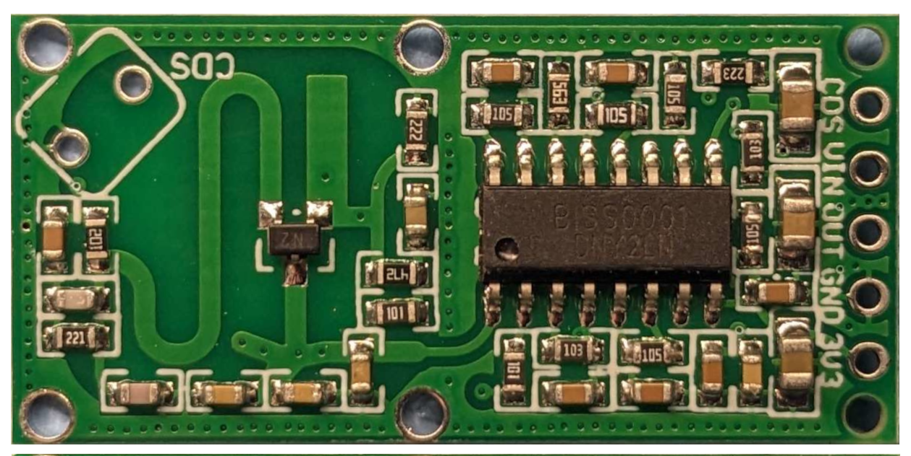
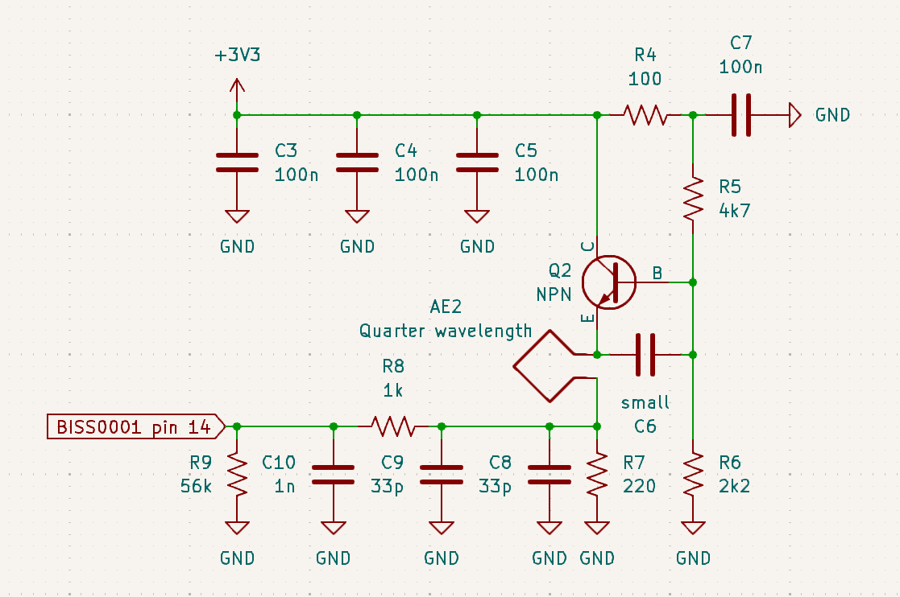

I recently got some cheap RCWL-0516 microwave motion sensors, mostly because I was wondering how China managed to make a radar for under a dollar:

[ Click for mirrored back view](boardrev.png)

Getting one working was quite easy, I just connected `VIN` pin to 5 volts, `GND` to ground and a 1 uF decoupling capacitor on the `3V3` pin.
When someone moves within ~5 meters, the `OUT` pin goes up to 3 volts for 3 seconds. 
Unlike with the more common infrared sensors, it works through plastic, glass, wood and drywall.

But how does it work?

The first thing I did was to find a datasheet for the the large SOIC-16 chip.
It turns out the `BISS0001` is an *infrared* motion sensor chip? How does that work?

In general, doppler radars work by sending out a continuous carrier and mixing the received signal with the transmitted carrier to create the IF signal at near DC.
If reflections are coming from a moving object, the received signal will slowly drift in and out of phase with the transmitted signal, resulting in an IF signal at just a few hertz.
Becuase a motion sensor doesn't care about the exact speed, all the chip has to do is look for rapid millivolt-level changes: all the hard work is already done by the mixer.

The IF signal enters the chip on pin 14, but the chip outputs an amplified copy on pin 16, which is much more oscilloscope friendly:[^biss]


The signal in the middle of the screen is from moving a laptop ~40 centimeters towards the sensor, the slower shifts on either side are from reaching over to start and stop the scope.
This is actually enough to figure out what the frequency is: When I was moving the laptop, there were 8 peaks, meaning that the path length (round trip) changed by 8 wavelengths.
The change in the round trip path length was 80 cm, so the wavelength must be ~10 cm, not that far from the real wavelength of 9.4 cm.

# So where's all the magic?

All the RF stuff happens on the left side of the board using just a handful of components:



At first glance, the RF side is just a single transistor microwave oscillator:



The S shaped track on the emitter acts as a 3.18 GHz resonator[^resonator] and antenna, driven by an BJT transistor with feedback through the capacitance between the resonator and a parallel copper track.
I suspect the ring structure at the back is just to prevent oscillation at other frequencies, many very similar sensors don't have one, or just use a solid ground plane.
The oscillator is quite unstable, and drifts by several MHz from hand capacitance and biasing changes, which is likely why the module is quite sensitive to power supply noise.

Interestingly, the microwave oscillation is pulsed at around 20 MHz thanks to the RC circuit between the antenna and ground, creating this waveform on the emitter:


My scope can't see 3 GHz, but it's there everywhere except on the downward slopped part of the waveform. 

What's happening here is that as the oscillator runs, it changes the 66 pF capacitor, up to the point where the oscillator can't run anymore.
At this point the capacitor is quickly discharged by the 220 ohm resistor, allowing the oscillation to start in a few nanoseconds.
This pulsing allows it to work as a super-regenerative receiver, where even a tiny amount of RF makes the oscillator start easier, and the pulse frequency higher.

Well hang on, if it's receiving while the oscillator starts, before it transmits, how is it able to see the phase change from moving objects?

Well with the off-time of around 15 nanoseconds, any returns from a static object more then 2.5 meters away that originated at the end of the first pulse will arrive in time for the start of the other.
These static returns get added to any returns from moving objects, and the super-regenerative receiver detects the resulting amplitude modulated signal.
At short ranges the the return signal arrives before the oscillator has fully ramped up, making it easier or harder for it to oscillate depending on the phase.

This sort of radar-by-wishful-thinking approach is probably why the sensor seems to have very inconsistent performance;
Indoors it works very well, with up to 8 meters of range, but outdoors with no convenient static return it often it only works for a few centimeters.

# A bit of fun, an S-band transmitter:

The first modification I tried was to remove the capacitor that causes the self quenching, which is actually two 33 pF capacitors in parallel:


This turns the thing into a transmitter, applying a signal to just about anywhere in the oscillator will frequency modulate it, and the thing can be on/off keyed by cycling power.

Interestingly, the radar does still work without the pulsing and super-regenerative parts, except that the IF signals are much weaker, drastically reducing the sensitivity.
What's happening here is that the the oscillator itself is acting as a mixer, down converting the return signal, but without on the gain of a super-regenerative configuration.

# Bistatic radar:

Ok, so can we use this in a more conventional radar setup?
I tried placing another unmodified module acting as the receiver next to the transmitter, which resulted in a much more consistent return signal:


Signal from moving a laptop towards and away from the radar.

The strange amplitude variations are gone and the return from my relatively slow moving hand is much weaker, as expected from a doppler radar.
On the other hand, overall the signals are weaker because the receiver is constantly being blasted by RF from the transmitter.
It also functions worse as a motion sensor is that now it needs significant movement towards or away from it to trigger, not just any change in the fields around the sensor.

On the other hand, it works quite nicely as a speed sensor by running an FFT or simply detecting zero crossings on the IF (on pin 14/16 of the chip).
The math for this is quite easy, just multiply the wavelength by the beat frequency and divide by 2 for the speed.
For example, the highest beat frequency in the scope trace was 15 Hz, so the speed was .7 m/s:

```
9.4 cm * 15 Hz / 2 = 70 cm/s = .7 m/s
```

If the two modules are separated by 2 meters or so, the outdoors performance is much better then with just a single module, with the best sensitivity in the area between the two modules.

[^biss]: The chip actually has several integrated opamps, window comparitor and RC timer. The gain, sensitivity and timings are all set with external passive components.

[^resonator]:
	It's a microstrip transmission line, 1/4 of a wavelength. The capacitor at the end shorts the RF to ground, reflecting it back towards the transistor.
	This also happens at multiples of 3.18, the circle structure on the back probably stops these higher frequency oscillations.
