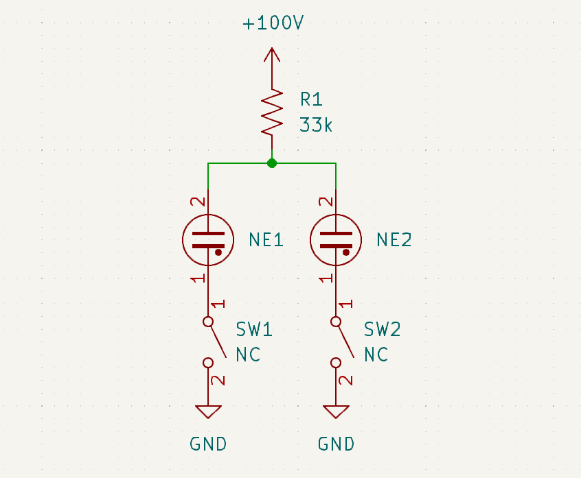
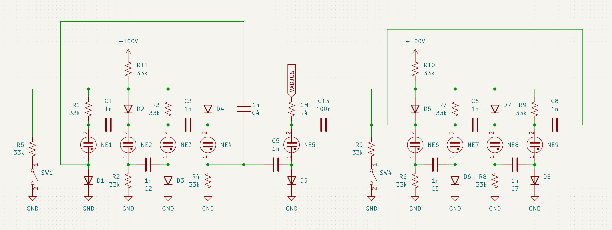

Neon lamps have a unusual property;
When the striking voltage, typically around 90 volts, is applied, the neon inside ionizes and begins to conduct, creating a nice orange glow.
Once ionized, a lower voltage is required to keep the neon glowing, typically around 60% of the striking voltage, the maintaining voltage.
This is why they always need a series resistor, to prevent them from drawing a huge amount of current once they light.

<!-- A typical neon light circuit --->

A typical circuit for powering a neon lamp.

Because a neon will continue conducting well bellow the striking voltage, if two are connected with one resistor, only one will light:

<!-- A neon rs latch--->

Switches are normally closed.

One lamp will strike slightly earlier, pulling down the voltage across the other and preventing it from lighting.
If the ground path of the glowing lamp is interrupted by the switch, it allows the other lamp to strike and it will remain glowing even when the switch is closed again.
This latching behavior can be taken further with a simple ring counter:

<!-- Neon ring counter -->

This circuit looks complicated, but ignoring the capacitors, is effectively the same as the last circuit with more lamps.
Even with the extra series resistor, if the applied voltage is not too high, a single glowing bulb will still pull down the supply enough to prevent the others from striking.

If a lamp is glowing, for example NE1, there will a voltage across its series resistor, here R2.
This voltage charges the capacitor C1, because other side is shunted to ground by D2.
When the switch is closed, it pulls down the power rail below the maintaining voltage, turning all the bulbs off.
With no current flowing trough the resistor, the voltage across it drops to zero, creating a negative voltage on the other side of C1.
When supply comes back up, this negative voltage allows the next neon, NE2, to light before all the others.
The next stage works on the same principal, just referenced to the supply.

Modern neons are not manufactured very precisely, so if the counter gets suck or skips a step, make sure to select lamps with similar striking voltages.
Another potential problem is that the capacitors can pick up stray charge, causing miscounts.
The solution is to add a large, ~10 MOhm, resistor in series with the problematic capacitor to bleed off charge.

These counters can be chained using a simple amplifier stage:

<!-- Neon buffer stage -->

Click image for a larger version.

The amplfiers's supply voltage has to be adjusted (this can be done with 100k or 1M potentiometer) to just below the striking voltage.
When the counter stage on the amplifier's input turns off, it creates a negative voltage on one side of the lamp, allowing it to light.
Once conducting, the lamp continues glowing until it discharges the capacitor to below the maintaining voltage and goes out[^out]. 
In the process, it feeds a much stronger pulse to the next counter then the one that triggered it.

The amplifier does not need matched lamps, but it does need careful adjustment to work, and each bulb requires a slightly different voltage.
The correct adjustment point also varies with age, and sometimes even ambient light.

Old trigger tubes like the MTX-90/MTH-90 should work better with less selection and adjustment because of the large difference in striking and maintaining voltages (300 and 80 volts), and because they are less effected by ambient light.
I don't have any to test, but the specs look good enough to allow directly chaining counters without buffer amplifiers.

I also did some experiments to see if a nixie tube could be used in place of 10 neons in a similar counter arrangement.
Unfortunately, once the nixie ionizes, all the electrodes are able to conduct.
Instead of suddenly striking, as the voltage on an electrode increases it gradually goes from dark to glowing.
A counter can drive a nixie, either directly or with a photo resistor, but it still needs other neons to do the actual counting.

[^out]: If the lamp keeps glowing, try changing the parallel capacitor or the resistor. The sizes in th schematic will only work for slow count rates, other values will also be needed for high speed counting.
