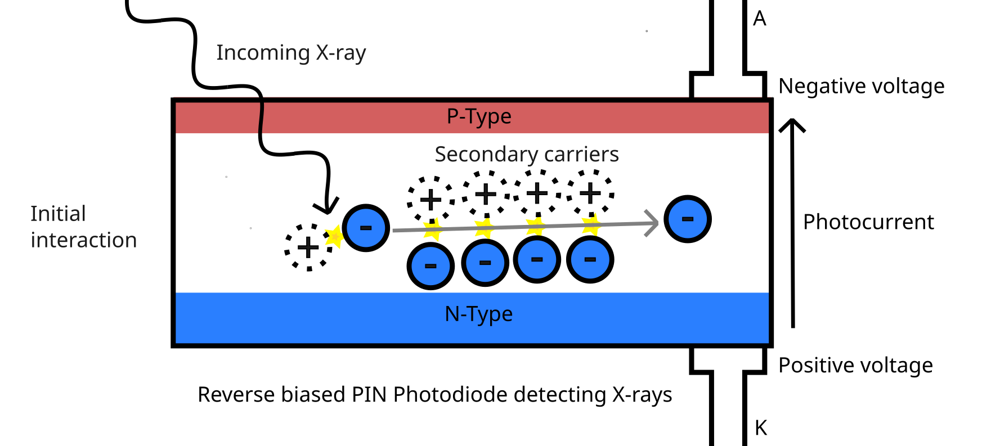
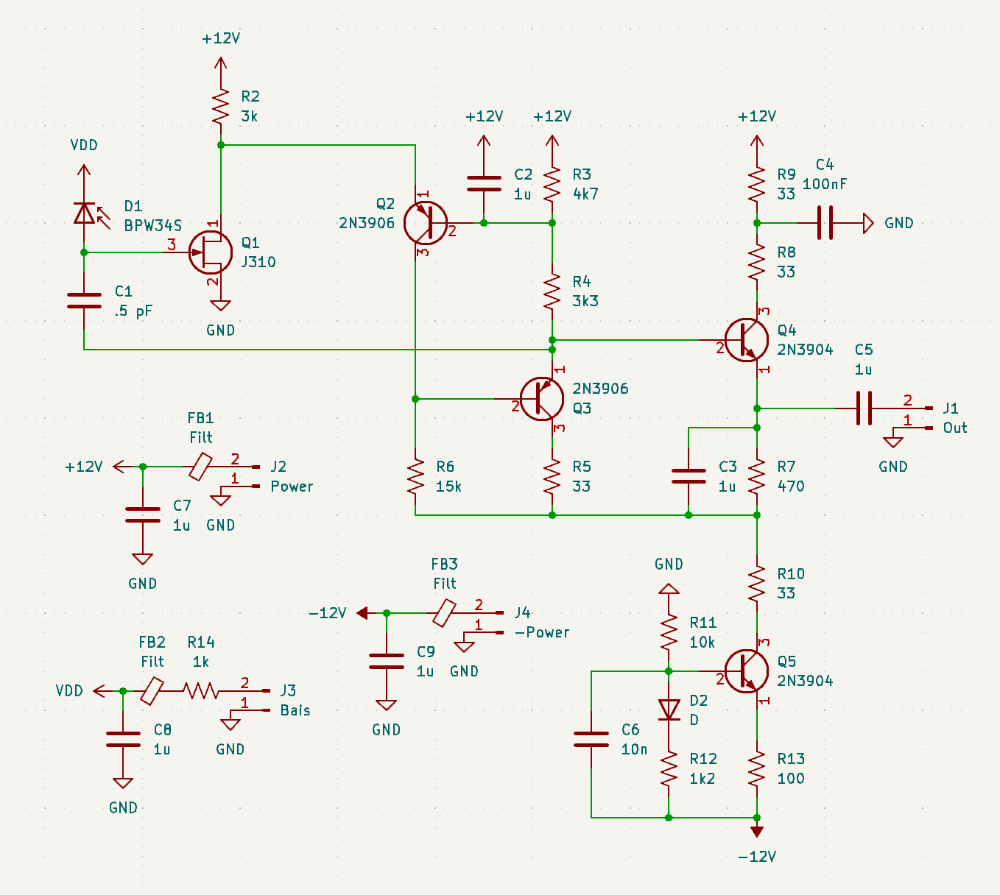
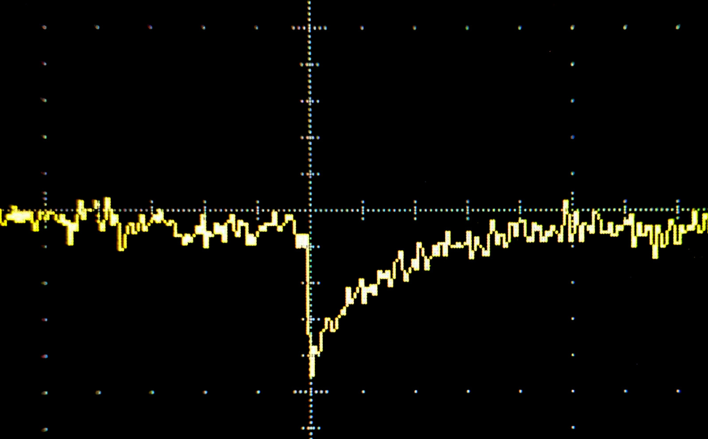

<!-- Diode -->
PIN photodiodes are [diodes](https://en.wikipedia.org/wiki/P%E2%80%93n_junction) with a thick undopped/intrinsic layer between the P and N-type regions.
This layer is typically around .1 mm, creating a similarly thick depletion layer.
When light shines into the depletion layer it liberates electron-hole pairs, which, if reverse biased drift into the dopped regions, allowing a small current to flow.

# X-rays:

<!-- X ray interaction -->

An X-ray photon[^photon] can also knock an electron free, but the excess energy causes it fly trough the semiconductor, knocking more electrons free: 

(not to scale)

<!-- Energy limit -->

A limitation of a photodiode is that higher energy X-rays can pass trough the depletion layer without interacting, causing sensitivity to fall off above 22 keV per photon.
Because of this, the background count rate in a metal enclosure very low, as any photons that can pass into the enclosure are not likly not be detected.
If needed, these higher energy photons could be detected with a sintillator in front of the photodiode.

<!-- Need for gain --->

Despite the photocurrent from a single photon being much higher then with visible light, the signal from a single photon is still *tiny*.
Around 3.6 eV[^ev] of energy is required for each electron-hole pair, which will allow one electron to flow trough the diode.
Therefore, a 10 keV X-ray photon will allow 2780 *electrons* to flow, moving .44 *femto*-Coulombs of charge.

# Amplification:

<!-- Preamp -->

To prevent it from being overpowered by stray capacitance or noise, the signal has to be amplfied.
I used this configuration with a BPW34S photodiode, which has a .1 mm thick intrinsic region, a 7.5 mm active area and 70 pF of capacitance with no bias[^diodecap]:

The supply voltage is shown as 12 Volts, but is not critical; 9 Volts from a battery works just fine.
This circuit is based of a design from ["A novel charge sensitive preamplifier without the feedback resistor"](https://doi.org/10.1016/0168-9002(93)90334-E).

The amplifier uses an unconventional input stage, with a forward biased JFET[^fet] (FBFA).
JFETs can still amplify in this configuration (the cutoff voltage should be close to zero), and it helps to bleed off any accumulated charge.
R2 is not super critical, but Q1's drain should be at least .8 volts above ground[^fet].
<!--Q2 and Q3 form an amplfier, with Q2 in a common base configuration, and Q3 in common emitter.
Feedback trough R3, R4 and C2 keeps the ampiflier correctly biased, allowing it to keep operating as the FET's drain voltage/current difts.
Q5 is a constant current sink, which together with Q4 buffer the output.
-->

C1 provides negative feedback, setting and stabilizing the gain, a smaller capacitor would provide more gain, and a larger less.
A .5 pF capacitor can be created by placing two 1 pF capacitors in series, and even smaller ones can be made by twisting together insulated wires.

# Results:

<!-- Results -->

When a X-ray hits the photodiode, the amplifier produces a dip in output with a short fall time (90 ns), but a long tail lasting around a millisecond:

The photodiode was exposed to 10 keV X-rays from a tritium filled tube. 1 mV and 1 ms per division.

The amplifier and detector are very sensitive to stray electric fields, and must be placed in a grounded metal box.
Additionally, the detector needs to shielded from light, even a small amount of light will reduce gain and increase noise, as well as creating ringing and even oscillation.
A piece of aluminum foil, around 16 μm thick, can be used as an window to let x-rays in.

The supply also needs to be clean, the filtering can improved with a 100 Ohm resistor in series with the supply, or alternatively just by using batteries.

From C1's value, the theoretical output can be calculated: 

`10 keV / 3.6 (eV/e) / .5 pF = .89 mV`

This is near identical to the measured .9 mV per 10 keV, nice.

The signal is still quite weak, and the long tails often overlap, cleaning this up will be detailed in the next post.

# Noise:

The noise, once shielded from RF and light, is dominated by the detector's noise and JFET's noise.
Both of these can be reduced by cooling down the circuit, but this does effect the optimal value of R2.

A sneaky source of noise is the detector capacitance, a large detector capacitance will reduce the voltage seen on the JFET's gate.
The feedback loop will compensate with more gain, increasing noise.

An easy way to reduce the capacitance is to increase the bias voltage, but this also increases leakage current, so the optimal voltage has to be experimentally determined.
Another fix is to use a smaller area photodiode, but these also have lower sensitivities.
Specialized X-ray detectors with very small capacitances and a built in FET exist, but they are rather expensive.

Osciloscopes are also not the best for small signals, mine has ~200 μV of noise peak to peak, even on the lowest bandwith setting.
Most of the noise in the trace still appears even with the probe unpluged.
A quick improvement is to use a 1x probe or directly connect the scope to the circuit, becuase a 10x probe will attenuate the signal to 1/10 of the orignal amplitude, making scope noise 10 times worse.
With a 10x probe the signal shown in the "results" section would be burried under 2 mV of noise.

[^photon]: Interactions between an electron and light are quantized, either a electron absorbs the entire photon energy (planks constant \* frequency) or none of it.
[^ev]: An Electron Volt is simply the amount of energy needed to move 1 electron across 1 Volt of potential difference. Knocking an electron free in silicon is equivalent to moving it across 3.6 volts.
[^diodecap]: The capacitance drops dramatically as the diode is reverse biased, down to 25 pF at 5 V.
[^fet]: 
	It could be modified to keep the gate bias negative by by reversing the photodiode polarity and bias, and adding an extra diode to ground to bleed off leakage current. 
	This might be needed for some FETs to keep the current draw reasonable.
