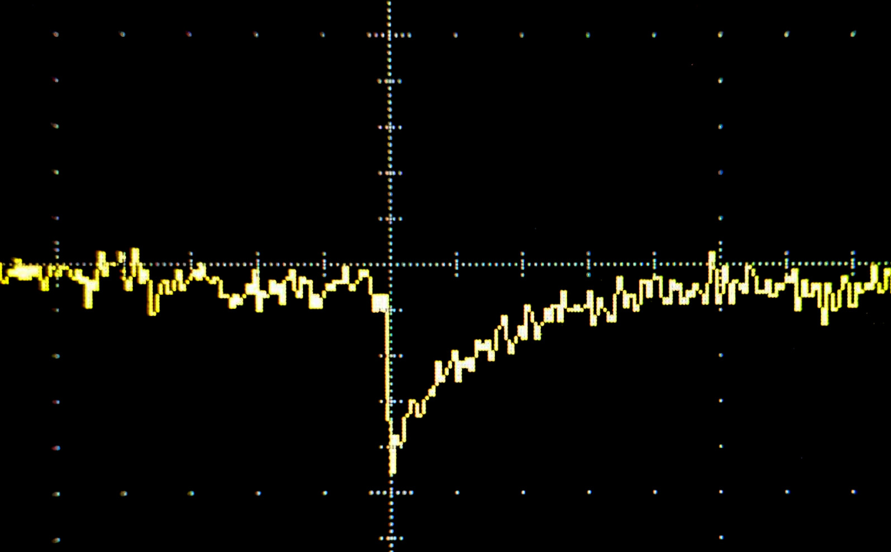
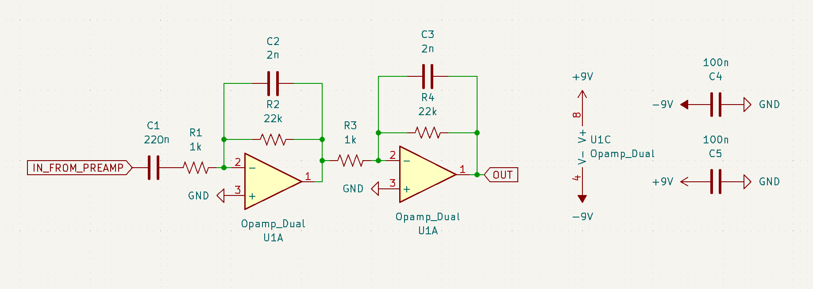
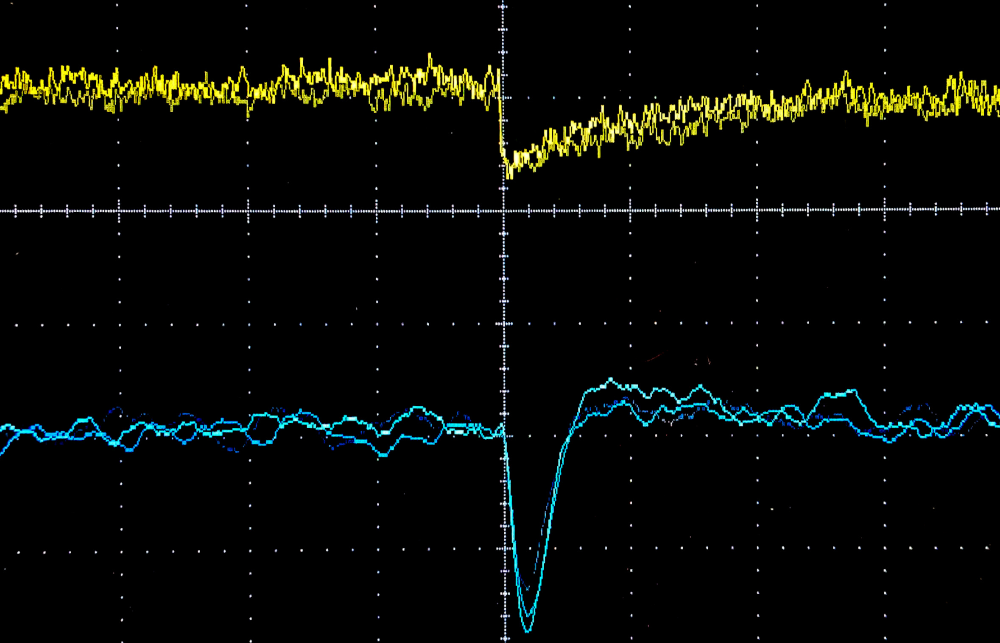

<!-- https://www.ncbi.nlm.nih.gov/pmc/articles/PMC3470605/ -->

[Yesterday](/projects/pin_xray/), we demonstrated detecting soft X-rays using a BPW-34 PIN photodiode, and a charge sensitive preamplifier.
Unlike a conventional G-M tube, the photodiode can measure the energy/wavelength of X-ray photons, which is characteristic of the source.
However, the raw output from the preamplifier is not very usable; It is very weak, noisy and the pulses have long tails:

10 keV X-ray. 1 mV/1 ms per division. (It's hidden by an aggressive bandwith limit, but there is 2 mV RMS noise here.)

The simplest (but not quite the best) circuit to clean this up is a RC high pass combined with 2 transimpedence amplifiers acting as low-pass filters:

Most op-amps will work, lower noise is better.

The RC high-pass detects the sudden change on the input, and the low-pass smooths the pulse and removes most of the high frequency noise:
The resulting pulse has a nice rounded peak, making it easy to measure:

Yellow: input .2 ms/1 mV per division (aggressive bandwidth limit on scope). Blue: output .2 ms/50 mV per division.

This circuit has a gain of around 100, or 20 dB.
It should ideally be shielded in a metal enclosure, both to reduce noise and to prevent the entire circuit acting as an antenna and feeding ambient RF into the detector.
(Also known as "Why does my circuit not work near cell phones?")

Larger capacitors and resistors can be used to create slower pulse and improve SNR by filtering out more noise.
Another optimization is using a different filter topology, like Sallen–Key, to remove more noise, and an extra stage to compensate for the overshoot after the pulse.
