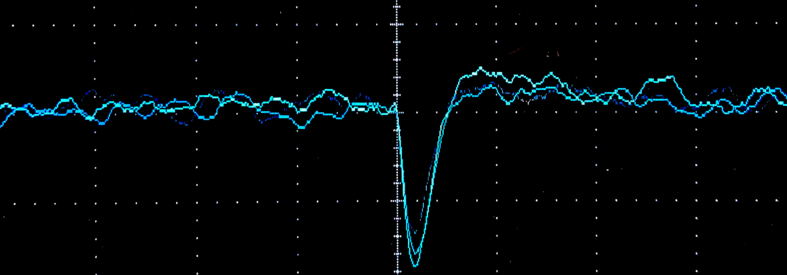
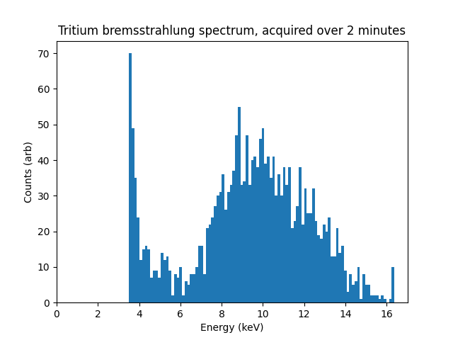

The [pulse shaping amplifier](/projects/pin_xray2) outputs short pulses with around 10 mV/keV:

.2 ms/50 mV per division

These pulses have a similar amplitude to audio from a microphone preamp, so they can be digitized by feeding them into a computer's soundcard.
If the computer has dedicated audio input, connect the circuit as the headset microphone using a TRRS plug.
Generally, the sleeve is ground, and the ring next to it is the microphone signal.
The soundcard will apply a bias voltage to power the microphone, so add a 1 uF MLCC DC blocking capacitor.

Make sure to disable any automatic gain/level control (AGC), and record uncompressed audio when capturing the signal.

Once captured, a simple script can measure the pulse heights, and plot a histogram of how many a given energy was seen:

The bremsstrahlung peak from 6-14 keV is clearly present, but not the characteristic X-rays from zinc at 8.6 and 9.5 keV.
The peak around 4 keV is just noise being interpreted as photons.
Nothing is shown before 3 keV becuase of a cut of in the processing program, to avoid millions of random counts.

With a setup that at least sort of works, it will be possible to optimize the circuit to get noise down to a usable level in future posts. 

Raw data from spectrometer: [Wave file](xray2m.wav), [Raw mono signed 16 bit little endian 44100 Hz data](xray2m.raw).

Python script used for plotting: [Source](plot.py).
