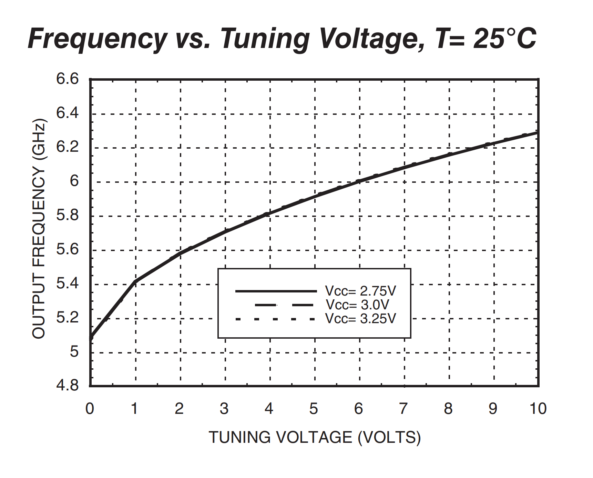

In principle, radar is very simple: just send out a radio wave and listens for reflections.
By measuring the time it takes for each reflection to arive, and knowing the speed of light, a radar can determine how far away the object is.

Of course, things are never that easy.
The main problem is that the speed of light is fast, very fast.

Light takes 3 nanoseconds to travel a meter, so for 1 meter resolution, a radar would need to sample the recieved power at over 150 megahertz.
Doing this is quite expensive, but fortuantly, much like [with oscilloscopes](/projects/fast_scope/), there is a way around it.

# The easy way:

In FMCW[^fmcw] radar, the transmitter continusly sends out a chirp signal, with a constantly increasing frequency,
The reciever mixes (multiples) the reflected signal with the chirp signal tapped of the transmitter:

The reflected signal is delayed, and at any instant is at a different frequency then the undelayed chirp.
The mixer converts this frequncy shift into a low frequency signal after the mixer, often just a few killohertz, which is much easier and cheaper to handle. 
Because the the resolution is limited by the RF bandwith, not the bandwith of the digitized low frequency signal, even the cheapest ADC can work just fine.

Once digitized, an FFT converts the IF signal into usable range information.

# Circuit design:

I decided on using 5.8 GHz, which is a wide (150 MHz) ISM band in my area, and is also used by WiFi, making components relativly cheap.

WiFi might cause some interference, but the short pulses and the radar's narrow passband at any given moment should make it easy to filter out. 
Because the information of interest is in the frequency domain, just about any interference will be filtered out, unless it follows the chirp around the band.

<!-- PLL -->

A chirp can be created by simply feeding a ramp into a VCO, but most VCOs are quite non linear (and this one is expensive, easly the most expensive part in the whole project):

This will cause the chirp's ramp rate, and the IF freqency to change over the course of sweep, ruining the range resolution at long distances.
There are ways of correcting this in software, but it's generaly better to get good data to start with.

To improve this, I used the ADF4158 PLL chip to drive the VCO, allowing it to constantly monitor and adjust the frequecy to create a near perfect chirp:

The PLL can also automaticly generate a frequency sweep, leaving the microcontroller free to do other things.
As a bonus, using a PLL ensures the output is exactly on frequency, to avoid stepping on anyone's toes.

<!-- Mixing -->

Because the IF frequencies will be very low, the flicker noise in the mixer matters.
I used the LTC5510 active BJT mixer to minize the drive requirements, allowing it to be driven by a simpler microstrip coupler rather then a power divider.
I considered the LTC5562, which is advertised as having low flicker noise, but seems extreamly similar, except for the harder to solder package.

Even the best mixers have quite a bit of noise, so I included a 30 dB LNA before it:

The BGU7258 amplfier chips are very cheap, so I included an extra one that can be switched in for some more gain if needed.

<!-- Range compenstaton -->

The recieved signal power is inversely proportional to the distance to the *forth* power: something one meter away that creates a return of 1 milliwatt will only produce a tenth of a microwatt.
At a hundred meters, that same object will create a return of 10 picowatts!

Simply digitizing the return from an the same object 1 and 100 meters away takes 80 dB of dynamic range, more then the maxium avalable from a 12 bit ADC.
Fortunatly, because range is proportional to frequency, a 40 dB/decade[^pv] high pass filter compensates, and should provide an roughly equal output regardless of range:

The first stage is an LC low pass, to filter out any stray high frequencies (mixing products from WiFi signals, etc), followed by a DC blocking gain stage, and finaly an active high pass filter:

The circuit doesn't have a particularly sharp low pass response aboce 65 kHz, which is the nyquist limit of my ADC, so some aliasing might be be a problem.
Fortunatly, in the case the rapid power loss with range is actually usefull, so something would need a huge radar cross section to cause sigificant alasing.

The downside of this approach is that the filter attenuates returns at close range, but these tend to be quite strong to begin with, and I wasn't trying to detect insects at 10 centimeters.

As for the brains of the radar, I grabed a AVR32DD32.
It has a nice feature where it can use a different voltage for some of it's pins (MVIO), which I used for the PLL which needs 1.4 volt logic for some reason.
The onboard ADC is also good enough, with 60 dB of dynamic range and a 130 kHz sample rate.
With just 4k of ram and an 8-bit processor it's not doing any heavy DSP, but should be perfectly capable of sending the data over to a laptop for processing.

The microcontroller got a crystal to keep the sample rate constant, and I just broke out the entirity of `PORT_A` which could be used for UART or even directly logging to an SD card.

This is the full schematic:

Click for PDF.

# Board desgin:

Unfortunatly most microwave parts are only avalable in leadless packages, making hand soldering impossible.
I left a lot of space in the RF section to make hot air soldering easier, at the risk of quite a bit of loss from the FR-4 substrate:

For the RF parts, I left a ground plane cutout under large pads like for the SMA connectors to minimize stray capacitance:

This could let some RF onto the power planes, and let power supply noise into the RF, but I hoped the large capacitance of the power plains would prevent that.

# Antennas:

The classic antenna for these things seems to be made from modified cans, but these are quite bulky.
I wanted to try a Antipodal Vivaldi antenna, which is in short just a flat horn antenna:

The antenna starts as a 50 ohm microstrip line, which then smothly transitions into a balanced lader-line like configuration.
There isn't any balun here, the electrons just sort it out among themselves.
The balanced line flairs out, transitioning the signal into free space.

At the low end, the antenna just works as a dipole, and is not very directional, so I designed it to work down to ~2 GHz, well below the 5.8 GHz of the radar.
Apart from that, I mostly just went with whatever felt good, and it is probobly not quite ideal.

Just like with the radar itself, I got this made on standard FR-4, which probobly adds quite a bit off loss,` but I don't have the equipment to measure it.

# Results:

# Math for nerds:

*This section is quite technical, and only important if you want to design your own radar, feel free stop reading here.*

Before building the radar, I wanted to get an idea of how good a given design could possibly work, and to get a baseline to compare the real radar to.

To start with, I picked a frequcy of 5.8 GHz, right at the center of a 150 MHz wide ISM band.
I felt this should be wide enough to allow good resolution, and there were also lots of avalable components for this frequency.

The range resolution of a radar depends only on the RF bandwith, using the whole 150 MHz allows a resolultion of 1 meter:

$$ \text{Resolution} = $$
$$ \frac{\text{Speed of light}}{2\times\text{Bandwith}} = $$
$$ \frac{3 \times 10^8 \text{ m/s}}{2 \times 150 \text{ MHz}} = $$
$$ 1\text{ meter}$$ 

I picked a chirp rate of 100 Hz (10 ms each), which togther with the bandwith is enough to find the ratio between IF frequecy and range, in this case 100 Hz/m:

$$ \text{IF range freqency ratio} = $$
$$ \frac{\text{Bandwith}\times 2}{\text{Sweep time}\times\text{Speed of light}} = $$
$$ \frac{150\text{ MHz}}{10\text{ ms}} \times (3\times 10^8)^{-1} = $$
$$ 100\text{ Hz/m} $$

I wanted to get away with the AVR's built in ADC, which tops out at 130 ksamples/second, giving a maxium frequency of 65 kHz, corisponding to a range of 650 meters:

$$ \text{Max range} = $$
$$ \frac{\text{Sample rate}\times.5}{\text{Range frequency ratio}} = $$
$$ \frac{130 \text{ kHz} * .5}{100\text{ Hz/m}} = $$
$$ 650\text{ m} $$

So far the everything looks quite good, but physics comes along to ruin it all:

# Noise & Link budget:

Thermal noise is the signal produced by heat jostling around charged particles in any material, and mostly just depends on the measurement bandwith.
Looking at the FFT, this will be the bandwith of a single FFT bin, which is one over the FFT length, which in my radar is the same as the chirp rate: 100 Hz.

$$ \text{Thermal noise} = $$
$$ \text{Boltzmann constant} \times \text{Temperature} \times \text{Chirp rate}^{-1} =$$
$$ 1.38 \times 10^{-23} \text{ J/K} \times 290\text{ K} \times \frac{1}{10\text{ ms}} = $$
$$ 4 \times 10^{-19}\text{ W} = -154\text{ dBm} $$

The reciever amplfier will also add some noise, expressed as noise figure, around 3 dB is typical.
It's also not enough for a return to be at the same level as the noise, it has to be significant stronger, let's say by 20 dB:

$$ \text{Minium Rx Power} = $$
$$ \text{Thermal noise power (dBm)} + \text{Noise figure} + \text{Needed SNR} = $$
$$ -158\text{ dBm} + 3\text{ dB} + 20\text{ dB} = $$
$$ -131 \text{ dBm} $$

This minium power, along with a somewhat pesistic transmit power (13 dBm) and antenna gain (10 dB), and the radar cross section of a target (say, a human) can be used to calcuate the detection range with the standard radar equation:
I was planning to transmit 20 dBm, but at 6 GHz a lot can cause a few dB of loss.

$$ \text{Max range} = $$
$$ \sqrt[4]{\frac{\text{Tx power}\times\text{Antenna gain}^2\times\text{Wave length}^2\times\text{Target cross section}}{\text{Minium Rx power}\times(4\pi)^3}} = $$
$$ \sqrt[4]{\frac{25 \text{ mW}\times10^2\times5.3\text{ cm}^2\times1\text{m}^2}{10^{-13.1}\text{ mW}\times(4\pi)^3}} = $$
$$ 428 \text{ m} $$

This can be improved with better antennas, using 30 dB parabolic antennas would allow a human could be detected 4 kilometers out.
(assuming it uses a slower chirp avoid hitting the limits of the ADC)[^justforfun]

Of course this is the theoretical maxium, assuiming just unavoidable noise. 
In practice, antenna loss, reciever overload, clock jitter, ground clutter and other effects will limit performance.[^pulse ]

At this point I had a set of general parameters that should be a good comprimize: 20 dBm transmit power, 150 MHz bandwith @ 5.8 GHz, 10 ms chirp, 65 kHz IF and 10 dB antenna gain.
For designing the reciever, I need a representive recieved power, and I picked the return from a typical person at 100 meters:

$$ \text{Recieved power} = $$
$$ \frac{\text{Tx power}\times\text{Antenna gain}^2\times\text{Wave length}^2\times\text{Target cross section}}{\text{Range}^4\times(4\pi)^3} = $$
$$ \frac{100 \text{ mW}\times10^2\times5.3\text{ cm}^2\times1\text{m}^2}{(100\text{ m})^4\times(4\pi)^3} \approxeq $$
$$ 10^{-10} = -100\text{ dBm} $$

A peak to peak 1 volt into the ADC is 0.7 volts RMS, which is around 10 mW into 50 ohms, or 10 dBm.
1 volt is quite a bit, so I decided to set this "typical" return at 30 dB down from that, or -20 dBm, which would require a total gain of 80 dB.
More RF gain will decrease the effect of flicker noise in the mixer and IF, but will make the reciever easier to saturate as it will happen before any kind of range compenstation.

I arbitrarly split this into 30 dB of RF and 50 dB of IF gain (at 10 kHz), which is finaly enough to spec out the whole system:

From the 2 dBm of VCO output, a resisive splitter provices -4 dBm into the PLL's feedback.
The F1490 PA has 34 dB of gain, so needs a -14 dBm drive, which I provided from with a -10 dB attenuator on the other branch of the splitter.
A -10 dB coupler takes 10 dBm of signal off the PA, which after another attenuator, is enough to drive the LTC5510 mixer.
The mixer's RF input needs 30 dB of gain, which can be provided by two 15 dB LNAs, like the BGU7258.
The final 50 dB of power gain (25 dB of voltage gain) will be provided by an op-amp circuit, which also acts as range compensation and anti-aliasing filter.

There will be a few dB of loss here and there, so I added an additional LNA, which can be switched on if needed, and kept in the "Bypass" mode if not.

I also calculated the thermal noise at the ADC, at the the 100 meters range (and using the real gain of the IF filter):

$$ \text{Noise floor at ADC (dBm)} = $$
$$ \text{Thermal noise power (dBm)} + \text{Maxium RF gain (dB)} + \text{IF gain (dB)} = $$
$$ -158\text{ dBm} + 39\text{ dB} + 60\text{ dB} = $$
$$ -68\text{ dBm} $$

This is just about above the ADC's quantization error, meaning that the radar will be limted by RF noise, and not the ADC.

[^resolution]: This formula actually works for any radar, not just FMCW designs. 

[^fmcw]: 
	Frequency-modulated continuous-wave radar, refering how the radar is constantly tranmistting, instead of using pulses, and how the signal is frequcny modulated to allow range measurement.
	Non modulated CW radars do exist, but they can only measure speed, making them less intresting, except perhaps for police wanting to bust people for speeding.

[^pv]: 
	If this looks like 20 dB/decade, it's because the plot shows voltage gain, not power gain. 
	Voltage is power squared, so 20 dB voltage gain is the same as 40 dB power gain.
