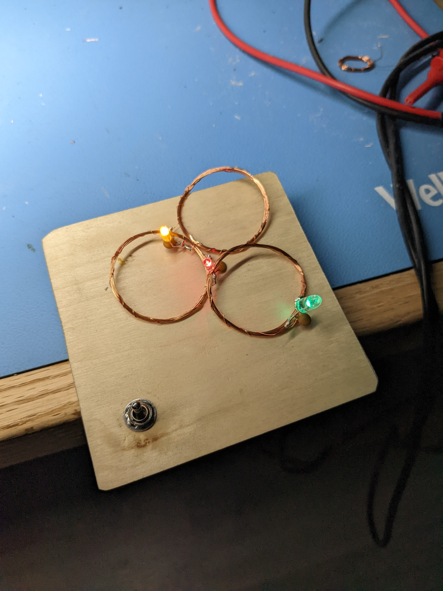
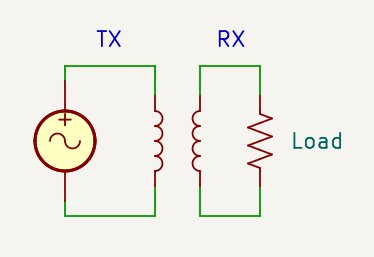
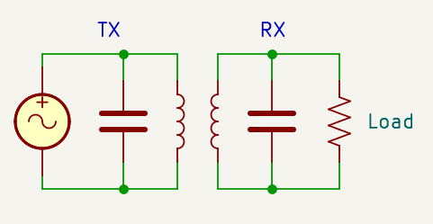
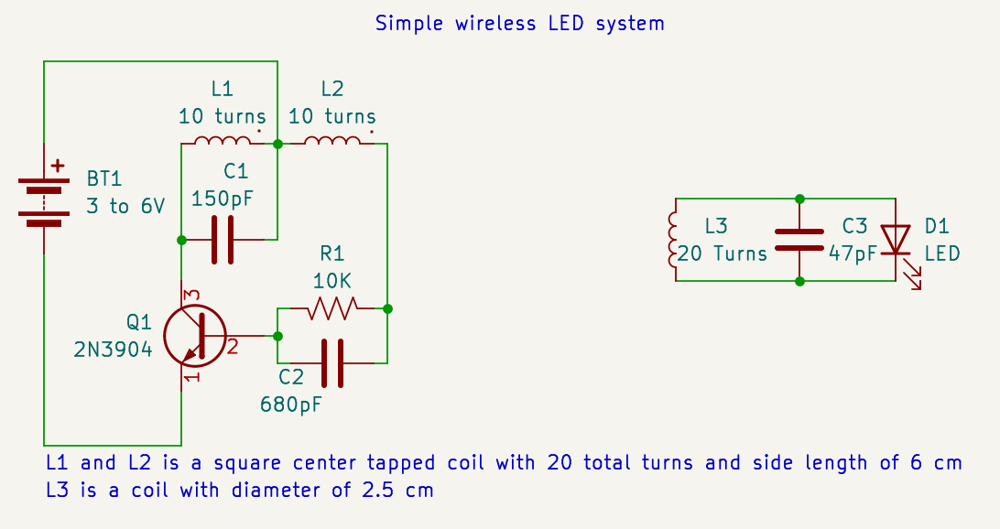

The core principal behind most wireless power systems is electromagnetic induction, where current flowing through a coil generates a magnetic field, and a magnetic field generates current in a coil.

Induction can be used to transfer power wirelessly by placing 2 coils next to each other; 
When alternating current is applied to one coil, it creates an alternating magnetic field, some of which then passes through the other coil, creating an electrical current in the coil:

An important aspect of induction is that the field has to change over time to create voltage on the coil and to transmit power.
This means that while it is *technically* possible to use DC, it is super impractical to transmit any thing more than a tiny pulse of power like this. 
The only way it would work continuously is if the coils were made out of a super conductor and the power supply could provide infinite current.

This method works, but it is very inefficient, because only a tiny fraction of the field from one coil passes through the other, most of the power used to create the field is never transferred.
Adding a capacitor recycles that energy, as the current in the coil falls, the capacitor stores the energy from the field as electric charge, and releases it back into the coil at the next half of the AC cycle:

The same can be done on the receiver side, to store and reuse any unused power. 

Rather importantly, any combination of coil and capacitor will have a natural resonant frequency, at which it will transfer energy between the capacitor and coil.
This frequency can be calculated using this equation, however it is often easier to experimentally determine it:

$$ f = \frac{1}{2 \pi \sqrt{LC}} $$

In practice, computing this is unnecessary, as you can just adjust the transmitter capacitor (or input AC frequency) for lowest power consumption, and the receiver for highest voltage or best range.

Creating a practical system is just a mater of connecting one tuned circuit, to an oscillator at the circuit's resonant frequency, and connecting a load (like an LED) to a matching tuned circuit:

This circuit is based on a blocking oscillator, where the transistor base is kept negative (turned off) most of the time, but when the voltage across L1 reaches the lowest point on the waveform, the transistor briefly turns on, providing a pulse of current that keeps the occilation going.
This has the consequence that the oscillation will be locked to the resonant frequency of the tuned circuit, and no adjustment is needed.

The unit shown at the top of this page uses a 6cm by 6cm, 20 turn, square, center tapped coil, and operates at 3 MHz.
To wind the coil, first wind 10 turns around a square, 6cm by 6cm, form, then leave a loop of wire hanging off (I recommended twisting the loop a few times to keep things neat), and then wind 10 more turns *in the same direction* to finish the coil.
This forms 2 coupled coils, sharing a connection, L1 and L2, it does not realy matter which one is which, but make sure that the loop of wire (center tap) is connected to the battery.

This should also work for most combinations of coils and capacitors, as long as L1 are L2 a single center tapped coil, and the receiving side (L3 and C3) is adjusted to match the resonance frequency of the transmitter.
The fastest way to adjust the receiver is to connect a variable capacitor in place of the fixed one, and tune to the best range and brightness, then measure the value of the variable capacitor to determine the optimal capacitor value.
