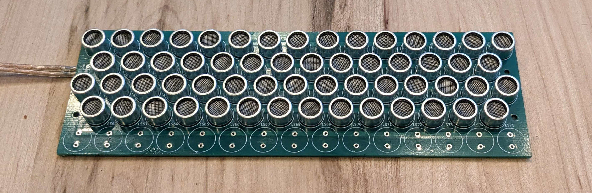
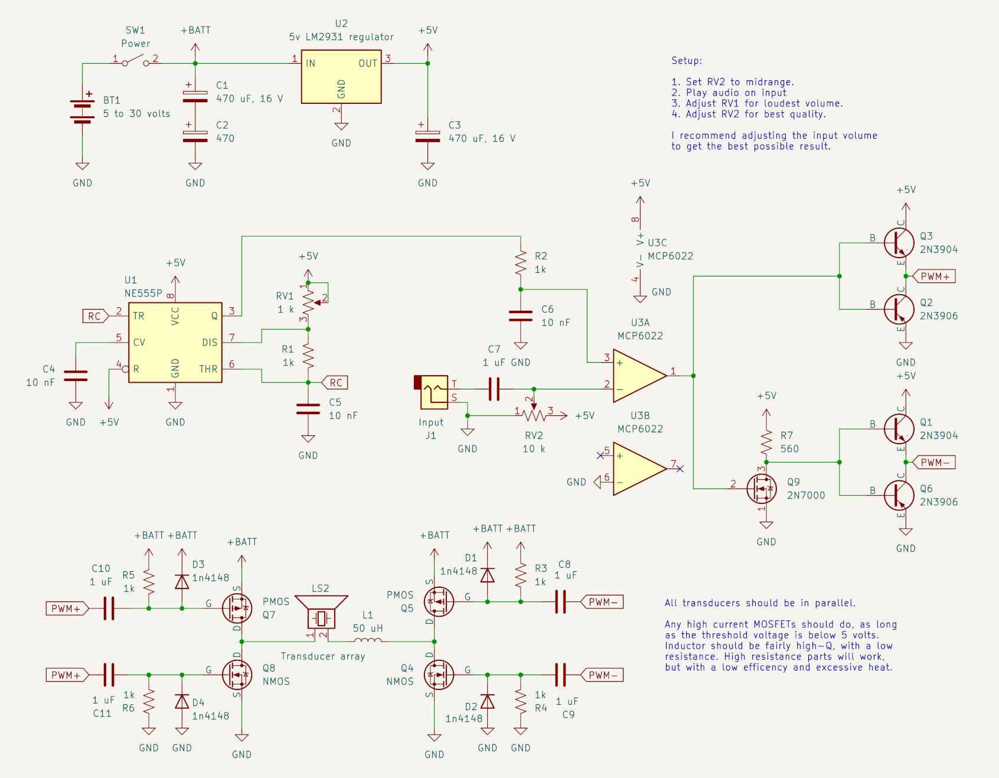
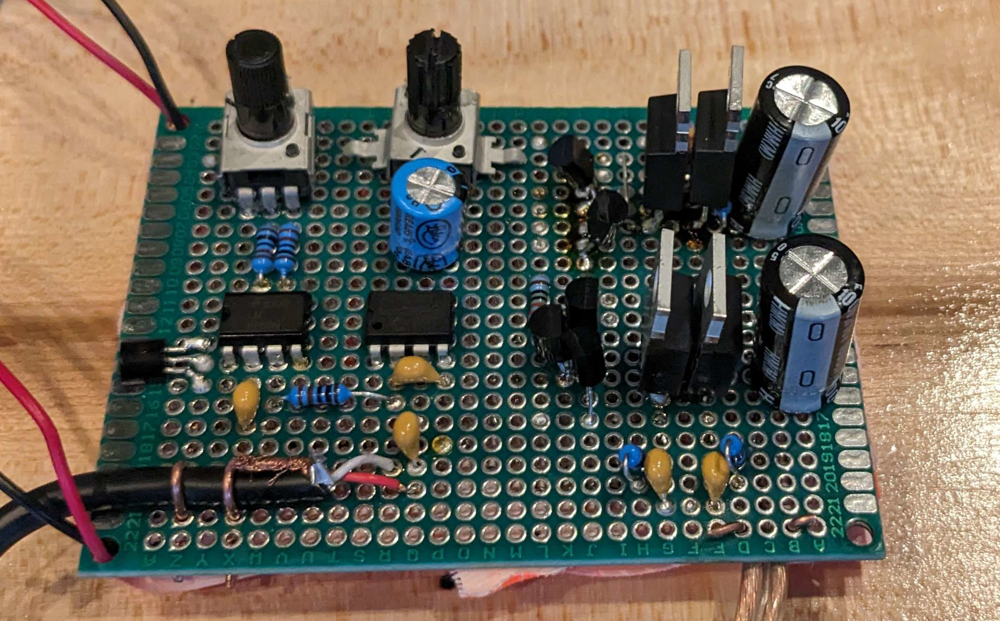

Most speakers emit sound in all directions because they are relatively small compared to the wavelength.
Audible sounds have wavelengths of up to several meters, so an acoustically "large" speaker might not even fit in your house.

Fortunately, strong modulated ultrasound [is slowly converted](https://en.wikipedia.org/wiki/Nonlinear_acoustics) to normal sound as it passes through the air.
Ultrasound wavelengths are typically around a centimeter allowing a compact directional speaker.

Ordinary coil-and-magnet speakers don't work well at the ultrasound range, so I had to use specialized piezoelectric transducers.
These are quite small, mine had a diameter of just one centimeter:


These transducers only work in a narrow range of frequencies, mine are designed for 40 kHz.
With the 8 mm wavelength, they are large enough for some directionality, but not nearly enough for the "sound laser" effect I wanted.

As a work around, I wired multiple transducers together in parallel to act as one very large transducer.
My circuit board has room for 73 transducers, arranged in a 18 cm by 6 cm rectangle:



This array is 20 wavelengths by 7 wavelengths, large enough to create quite a narrow beam.

[My transducers](https://www.digikey.com/en/products/detail/cui-devices/CUSA-TR80-15-2000-TH/13687405) had their polarity marked on the bottom, but on other models markings are often missing or misleading.
To test the polarity, hook up the transducer to an oscilloscope and lightly poke the ceramic disk inside. 
This should create 2 opposite pulses, one from applying pressure and the other from releasing it.
The polarity of the first pulse must be the same way around for the whole array.
Otherwise, half the transducers will be pulling air while the others are pushing it, resulting in no overall sound.

I would highly recommend testing a random sample before doing any soldering.

These transducers can't be driven from a regular audio amplifier, because they have very different requirements then normal speakers.
They are sensitive to *charge*, and need both high voltage and high current, unlike speakers which need some current but minimal voltage.

This is the circuit I designed to both generate the needed modulated ultrasound and drive the transducers:



It uses a 555 timer to create a 40 kHz carrier, which the op-amp pulse-width modulates with audio input.
Pulse width modulation is equivalent to amplitude modulation, but can be amplified without needing to preserve analog voltage levels.

Once modulated, the signal goes into a class B/push-pull amplifier, which drives the final stage, a MOSFET H-bridge.
I don't remember exactly what transistors I grabbed, but just about any enhancement mode power MOSFETs should work.

The final component is a loading coil, which resonates with the capacitance of the transducer making it much easier to drive.
The transducer's capacitance varies by an order of magnitude between different frequencies, so unless you have a LCR meter, its best to experimentally find the value that produces the highest AC voltage across the array.

Use the physically largest inductor you can, those will have the lowest resistance and will have lower losses to core saturation.

The maximum supply voltage is limited to 30 volts by the regulator, but that starts getting close to the transducer's maximum voltage, so it's not much of a loss.
Thirty volts is reasonably loud, quite competitive with a regular speaker.

Here's the prototype driver built up on a perfboard:



The result of all this is a beam of sound only a few degrees wide, just like a laser.
You can hear sound, take a step to the side and it completely disappears.

The beam also bounces off objects, making it seam like the sound is coming from somewhere else.
Strangely, the sound is actually louder when bouncing off a hard object like a wall then when listening to it directly. 
I'm guessing that the surface creates areas of higher ultrasound intensity, creating more sound then would be created otherwise.

It works quite well for rickrolling, especially if the sound is bounced of a wall to make it harder to track down.
This is my only pranking device that has everyone asking how it works.

On the other hand, it's not really a good speaker.
It has virtually no bass response, tends to distort louder audio, and is not all that loud.

It also does strange things to microphones, playing a low frequency (10-200 Hz) sound will completely ruin recordings, even when not directly pointed at the microphone.
This depends on the ultrasound directly hitting the microphone, which can be stopped with a wind cover or by sitting on the microphone.

# Just why does this work?`

It's not immediately intuitive why a speaker being larger makes it more directional.
Imagine the sound waves coming from two points on the edges of the speaker.

If you're directly in front of it, the distances the sound has to take are identical, and the waves add up, creating a loud sound.
However, if you're to the side, the distances will be different, and one of the waves will be shifted, canceling out the other.
The larger the speaker, the larger the phase difference will be, and narrower the beam is.

With waves coming from just a two points, there are lots of other spots where they will coincidentally line up, but with enough points this won't happen anywhere except directly in front of it.

For those interested in making own, you can use this formula to estimate the beam half-angle from the length:

```
angle of first null = asin(wavelength / (2 * size))
```

The shorter the array is in a direction the wider the beam will be in that direction.
When held horizontally, a rectangular array will create a vertical fan pattern, fairly well suited for our mostly horizontal world.

It's also important to minimize the spacing between transducers, gaps larger then a 70% of a wavelength or so will result in beams of sound coming out at weird angles.
