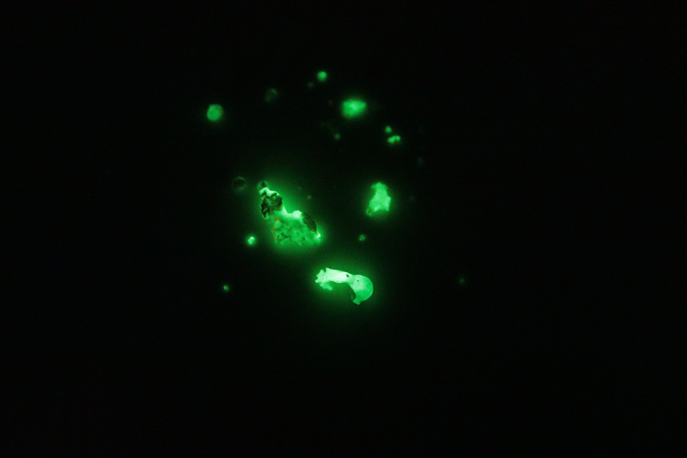
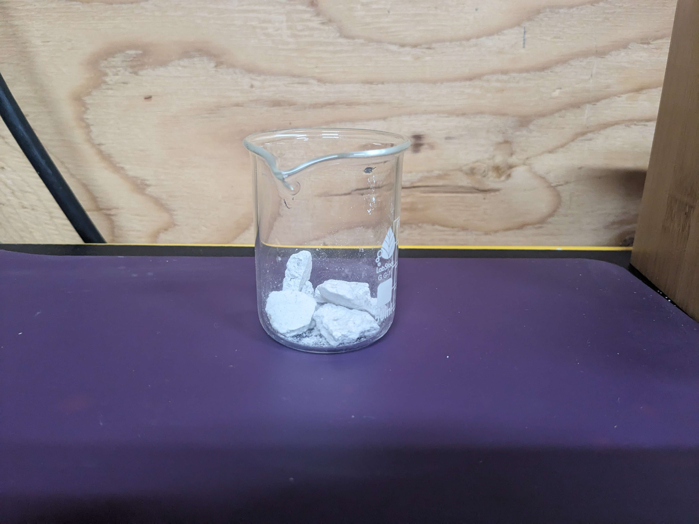
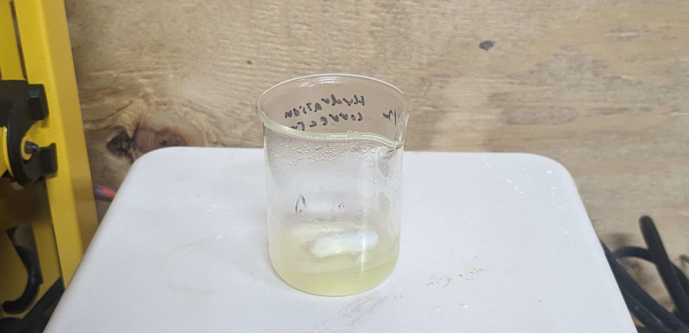
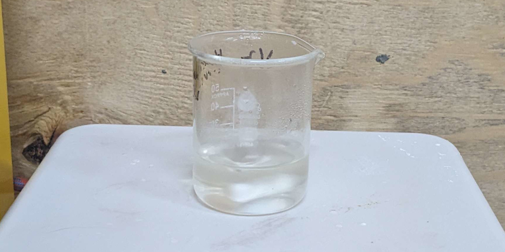
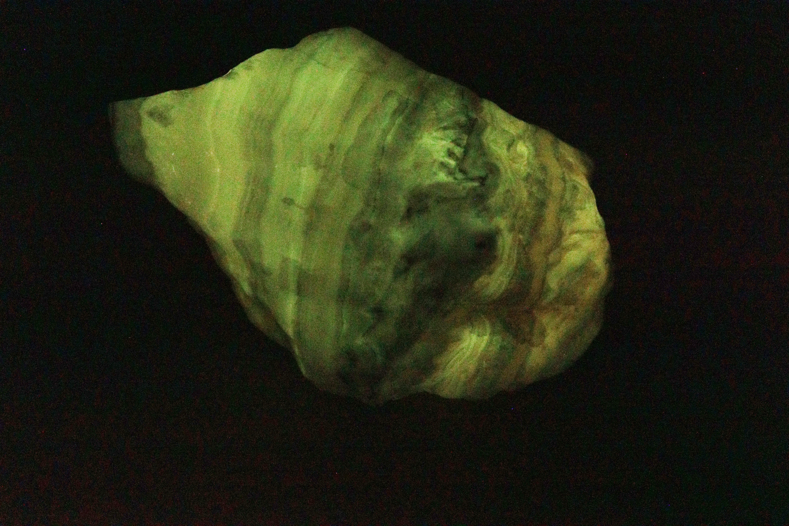

Important disclaimer: 
Several of the reagents used here are very corrosive and can produce toxic gasses.
If you try to repeat this, at the very least **please wear eye protection** --- no project is worth permanent blindness.

Making things that glow in the dark is fun, but I wanted to do something more then just buy glow powder from china.

The undisputed king of glow in the dark materials is Strontium Aluminate (SrAl2O4) which glows brightly for hours after exposure to light. 
Even better, all the components are fairly easy to get:
Oxygen is everywhere, Aluminum is quite common, and while Strontium sounds exotic, it's rather easy to buy for making ceramics.

Because it's nearly impossible to mix metal oxides on an atomic level, strontium aluminate is usually made by decomposing soluble nitrate salts:

2 Sr(NO3)2 + heat (~600 C)  ➙ 2 SrO + 4 NO2 (gas) + O2 (gas)

4 Al(NO3)3 + heat (~200 C)  ➙ 2 Al2O3 + 12 NO2 (gas) + 3O2 (gas)

SrO + Al2O3 + heat (~1200 C) ➙ SrAl2O4

To make the aluminum nitrate, it's not possible to just dissolve aluminum metal in nitric acid, so I first made some aluminum hydroxide from potassium alum (a food preservative):

2 KAl(SO4)2 + 5 NaOH   ➙ 2 Al(OH)3 (precipitates) + 3 Na2SO4 + K2SO4

To start, I dissolved some alum in water, and then added dilute sodium hydroxide to precipitate out aluminum hydroxide.
This is what the product looked like after being filtered off and dried at 120 C to remove any traces of water:

While chemically simple, this was by far the most annoying step of the whole process. 
For one, if too much base is added, the aluminum will redissolve, so I had to keep checking the pH.
Secondly, the reaction created a very annoying clay like product which took days to filter and wash.

After that mess, I weighted out
1.74g (10 mmol) of the aluminum hydroxide I just made,
0.73g (5 mmol) of strontium carbonate,
0.01g (0.005 mmol) of Europium (III) oxide,
and 0.02g (0.01 mmol) of Dysprosium (III) oxide. 
After combining everything together, I added water and nitric acid until it all dissolved.

The lanthanides are doppants: small amounts are needed to make the material glow, and different ones create different colors.
I picked Eu+Dy because it produces the brightest glow, and that classic glow-in-the-dark green color.
(which happens to have a wavelength right around the peak sensitivity of the human eye)

I then evaporated the nitrate solution until just a mixture of salts was left.
It's super important to get rid of all the acid at this point.
It should be heated to above 120 C, and keep there until no fumes are being produced, even when the chunks are crushed.

I then added 8.41 grams (140 mmol) of urea and enough water to dissolve everything:

This urea both interferes with crystallization, which could otherwise separate the different salts, and can act as a fuel in a combustion reaction.
(It can also form explosive salts with any left over acid, which is why it's important to remove it all.)

After being heated to 300 C, the mixture formed a white foam.
When ignited, it burned slowly and with almost no flame.
Because it had a significant excess of fuel, the reaction also reduced the Europium to it's +2 state, which is the needed to make it glow.

In theory, this combustion should also produce enough heat to form the strontium aluminate, I couldn't get this to work.
Instead, I just heated the combustion ashes with an oxy-propane torch:

Once the partially melted blobs cooled, they were able to glow brightly, but only for a few minutes as opposed to the hours the commercial stuff is able to do.
I'd blame this on reagent purity: While I can't find any data on Strontium Aluminate specifically, many phosphors are very sensitive to stray metal ions, such as iron.

Quite a few papers also calcined the end product at 1300 C, but without a furnace that goes up that high, I'll have to be content making the stuff grain by grain with a torch.

On a related note, here's a cool phosphorescent rock from my brother's collection:

Photo taken one second after hitting with a xenon flash lamp.
I think it's agate with trace zinc and manganese ions (Willemite).
Trace uranium ions can also cause green fluorescence, but have no afterglow.

