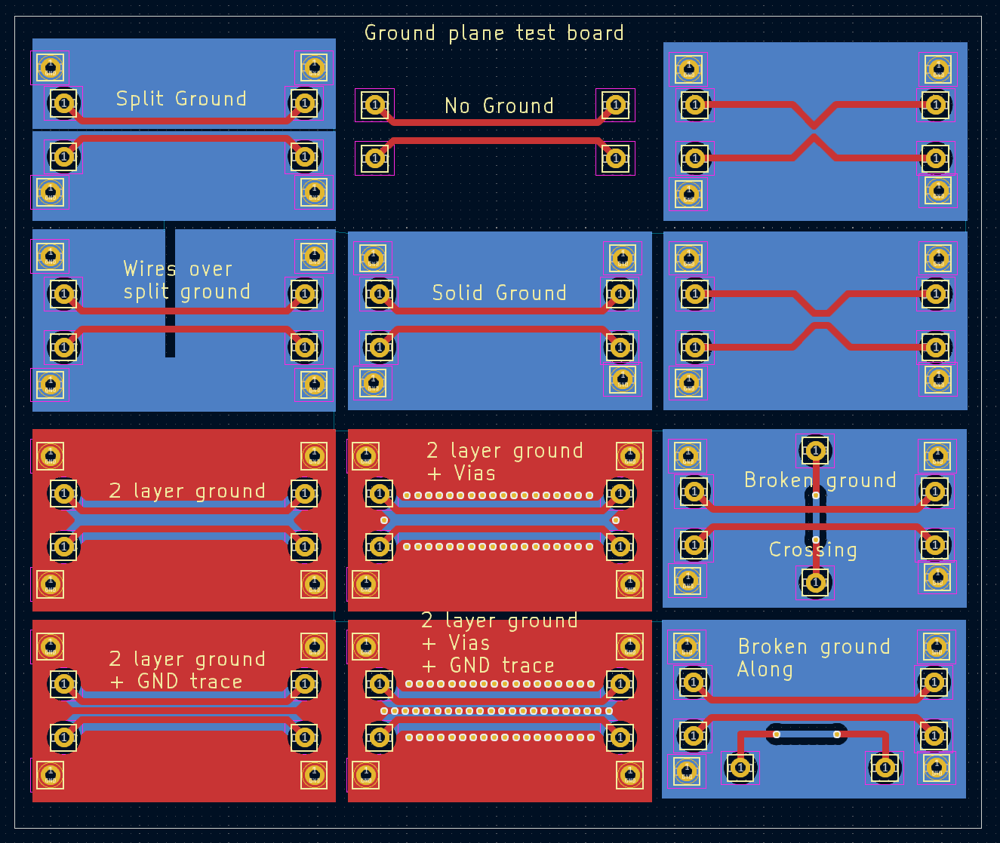
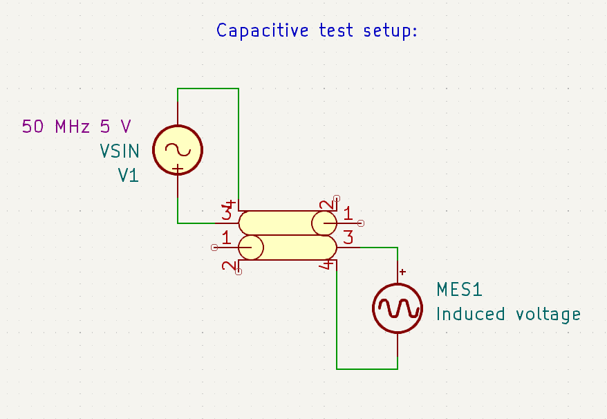
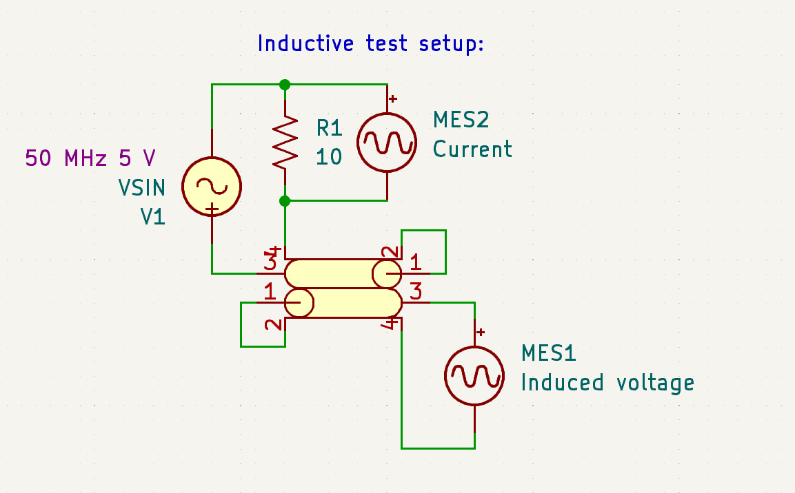

<!-- Intro -->

On the internet, you can find a lot of advice on how to design PCBs, particularly regarding ground planes and high speed or small signal routing.
But how much of this is correct, and does any of it matter for hobby projects?

<!-- Myths -->

Basically everyone agrees that a ground plane provides a low inductance and low resistance return path for current, and prevents crosstalk/coupling between traces.

A ground plane does this by providing a return path[^return] that is physically close to the trace.
Inductance and inductive coupling depend of the area of the loop formed, which minimized by a ground plane.
With capacitive coupling, the ground plane "shorts" the electric field between traces, minimizing *mutual* capacitance.

After these basic points, everyone starts disagreeing.
Some people say that a ground plane should be on both sides of the board, while others say just one.
Some say that it should be split between different areas of the circuit, and others say this makes things worse. 
Some say that you should place a shield trace between fast signals, others say you should not.

So to test some of these claims, I designed a (1.6 mm thick) board with pairs of 15 mm traces and 2 mm of clearance between them.
Both for capacitive and inductive coupling, long, parallel and nearby tracks are the worst case.
Each end of the traces had a pin, and if a ground plane was present, a ground pin was placed by the trace pins to keep the return path as close as possible:

One pair has no ground plane, another just a basic one on the back, and the rest have variations on ground planes:
- A split ground plane between two traces.
- A split ground plane with traces running across the split.
- A ground plane with a traces jumping onto the back layer. (One parallel and one across)
- A ground plane on both layers
- A ground plane on both layers with vias alongside traces.
- A ground plane on both layers with a shield trace
- A ground plane on both layers with a shield trace and vias alongside traces and on the shield.

I ran tests with a 50 MHz sine wave (10ns rise/fall times), which should be representative of a typical hobby project, but does not represent what happens in the microwave range. (The wavelength used is much larger then the traces)

# Capacitive coupling

To measure capacitive coupling, I connected a function generator set to 5v, 50 MHz sine to one end of one trace, and a scope to the other end of the other trace.
For tests with a ground plane, I removed the stock ground lead of the scope probe, and added a short (<2cm) length of wire from the probe's ground ring to the ground pane.
For the tests without one, I just clipped the scope's ground clip to the function generator's ground lead.

The scope probe has ~10 pF of capacitance to ground, around twice that of a 74HC gate input.
These measurements are only accurate to around 5%, so pay no attention to single milivolt differences.

|Coupled peak-to-peak voltage into 10 pF (More is worse)|Configuration|
|-|-|
|800 mV|No ground plane, ground provided by 15 cm scope ground clip.|
|340 mV|Standard ground plane.|
|352 mV[^split]|Split ground between traces|
|360 mV|Traces over split|
|351 mV|Standard ground with trace cutting across the ground plane crossing the tested traces|
|340 mV|Standard ground with trace cutting across the ground plane along the tested traces|
|294 mV|Double sided ground|
|300 mV|Double sided ground + via stitching|
|88 mV|Double sided ground + shield trace[^trace]|
|48 mV|Double sided ground + shield trace[^trace] + via stitching|

A ground plane reduced the capacitive coupling by more then 2 times, even in this worst case layout.
Splitting the ground plane, often recommended between power supply, digital and analog sections increased coupling.
A double sided ground only improved things if both sides were connected with vias, and worked much better if a grounded shield trace was placed between the two traces.
(more than 16 times better then no ground plane!)

At least at this much-smaller-then-a-wavelength scale, a short trace under the ground plane has a fairly small effect.
I also measured the signal coupled into the main trace from the one crossing it at on the back side at 153mV, significant, but not as nearly as bad as a parallel run.

Another thing of note about a ground plane is that traces over it have a significant capacitance to ground of around .7 pF per cm for the 1mm wide traces I used.
This can cause trouble for high impedance signals, even on relatively short traces.
Additionally, this capacitance will only get worse the more layers the board has, especially with the common habit of placing the ground/power planes in the middle layers of the board.

The driving impedance matters a lot for capacitive coupling, when the victim trace was driven through a 100 Ω resistor instead of being left open, the coupled signal dropped to ~1/4 of the original voltage.

# Inductive coupling

For inductive coupling, I alse used a 50 MHz sine, but grounded the other ends of the traces.
I also added a ~10 Ohm current shut (10mV = 1mA) to measure the current flowing.

Again, these measurements are only accurate to around 5%, so pay no attention to single milivolt differences.

|Shunt voltage peak-to-peak (More is better)|Coupled peak-to-peak voltage (More is worse)|Trace configuration|
|-|-|-|
|8 mV|62 mV|No ground plane, return path provided by scope/generator leads|
|12 mV|26 mV|Standard ground plane|
|11 mV|28 mV|Standard ground with trace cutting across the ground plane crossing the tested traces|
|10 mV|29 mV|Standard ground with trace cutting across the ground plane along the tested traces|
|8 mV|44 mV|Split ground between traces|
|9 mV|28 mV|Traces running over split|
|11 mV|28 mV|Two layer ground|
|9 mV|22 mV|Two layer ground + via stitching|
|10 mV|33 mV|Two layer ground + shield trace|
|10 mV|7 mV|Two layer ground + shield trace + via stitching|

The results here are similar to the capacitance results, and don't contradict any of the conclusions made there. 
While it looks like inductive coupling is insignificant compared to capacitive coupling, it can effect traces with a very low driving impedance (like the *0 Ohm* short used for testing), and the current used here was just a miliamp, not the several amps common for driving MOSFET gates and the like.

# Does any of this even matter?

While 50 MHz seems quite high, this type of coupling can happen be with digital signals.
Even of the frequency of a square wave is just a few kilohertz, it can have [harmonics up into the hundreds of megahertz depending on the rise time.](https://lcamtuf.substack.com/p/square-waves-or-non-elephant-biology)
Digital lines themselves are fairly resistant to interference because of the low impedance output and large gap between logic levels.

However, most projects at some point deal with analog signals, and these signals can easily be interfered with by fast switching digital lines.
The simplest fix is to physically separate digital and sensitive analog sections, as well as avoiding parallel traces between them.
Keeping the supply clean with decoupling capacitors, ferries and ground plane is also very important.
High impedance lines are problematic, so avoiding them if possible and keeping them short is ideal.
A via stitched shield trace over a ground plane is a good last resort.

Another statagy if coupling is unavoidable is to simply slow down the digital signals, for example by placing a 5 kOhm resistor in paralel with the output. 
This won't effect low speed signaling, but will slow down problematic edges.

Another case is when the return path for current is *not* ground, and for that a ground plane is a lot less effective.
In this case simply route the PCB so that the signal trace and return path as as close as possible, and keep the overall length short.

[^split]: This is the result I got after running a jumper to connect the 2 sides of copper fill. Without this the voltage was lower (150mV), because my scope and function generator were floating relative to each other.

[^trace]: The shield trace has just .5 mm clearance to the signal traces, so this configuration has some extra capacitance.

[^return]: The signal trace itself is only half of the circuit, and the return path is just as important.
