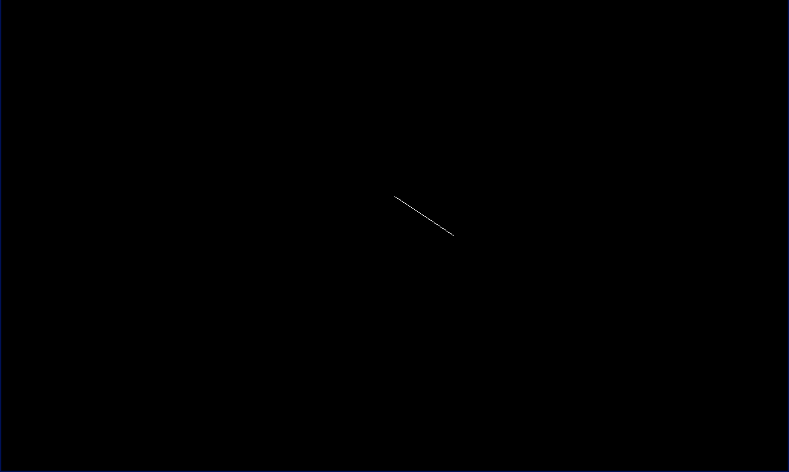
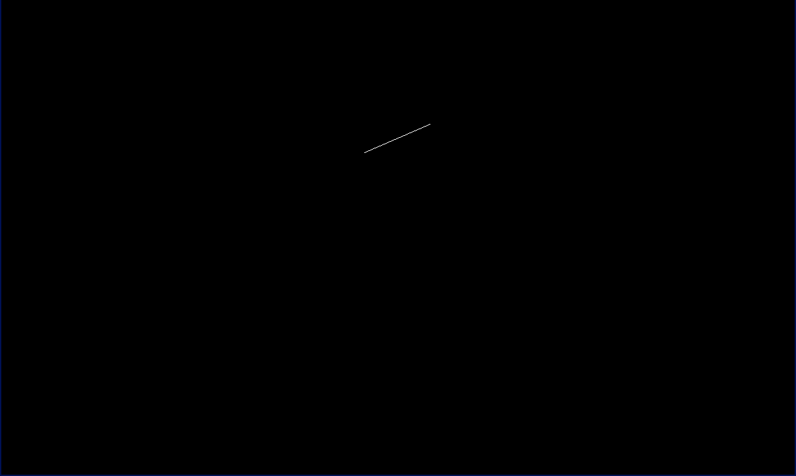
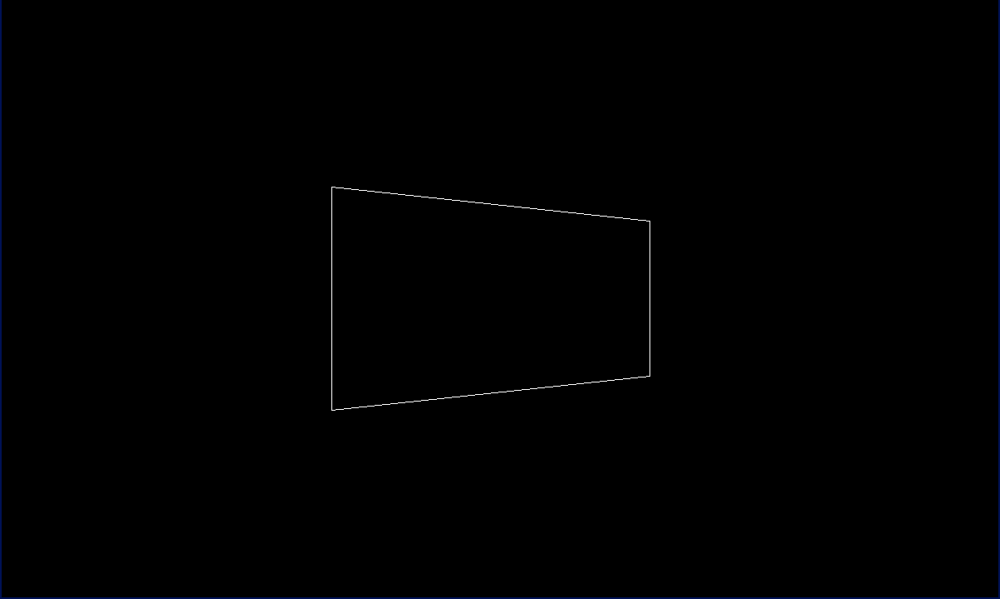
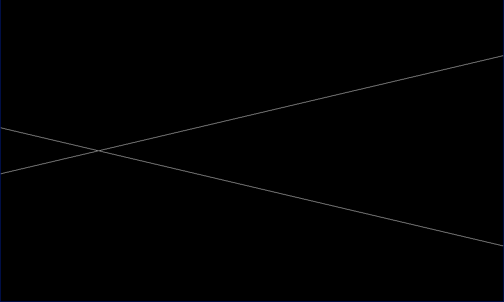
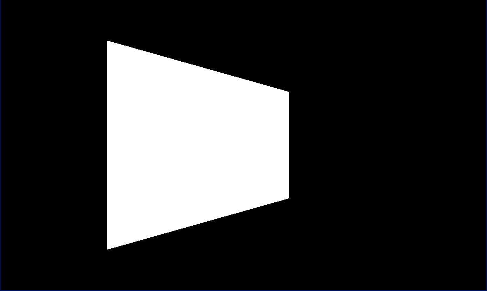
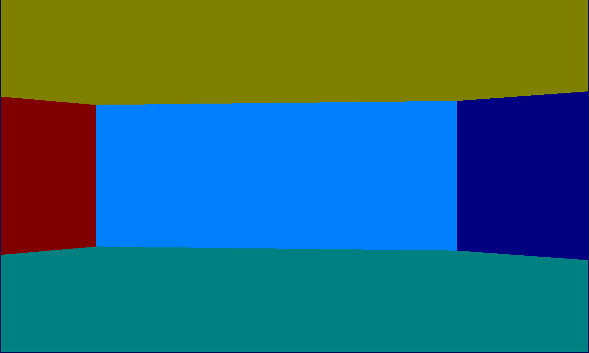

<!-- While graphics card are much faster at this stuff, and off-the-shelf game engines mean that you can make an FPS without ever touching a renderer,  -->

This series will go over the functioning of a simple Doom style 3d software renderer intended for a first person game.

A renderer needs something to actually render, lets start by placing a wall in the game world, representing it as 2 points in *2d* space. (don't worry, it will be 3d soon.)
If this is just drawn as a line on screen, the result looks like this:


Triple A graphics right?

<!-- Rotating Line -->

To make this first person, the end points of the wall need to be moved and rotated (this is known as transformation), according to the location of the player (camera), so that the player ends up at 0, 0.
This means subtracting the cameras position from the end point, and rotating them by the negated camera angle.
The code for this will look something like this:

```py
translated.x = world.x - camera.x
translated.y = world.y - camera.y

rotated.x = translated.x * cos(-camera.angle) - translated.y * sin(-camera.angle)
rotated.y = translated.x * sin(-camera.angle) + translated.y * cos(-camera.angle)
```

Applying that transformation to both endpoints of the wall, makes the wall move in the opposite direction that the player does:




<!-- 3D wall -->

To make this 3d, the program has to figure out where the wall should appear on the screen.
(I have, somewhat arbitrarily, decided that camera should be facing y+)

The x coordinates are easy, just take the (translated and rotated) x coordinates of the wall's end points and divide by the y coordinates.
The height of the wall on screen is just the height of the wall divided by the y coordinates of the endpoints.
The values are additionally divided by a value controlling the Field of View (fov).
A value of around 0.4 gives a nice 90° field of view if the screen coordinates are rendered so that the screen is from 1 to -1.

Assuming the height of the wall is one, the code should look something like this:
```py
fov = 0.4

screen_x = rotated.x / rotated.y / fov
screen_h = 1 / rotated.y / fov
```

Drawing a line between the top and bottom of each segment and the tops and bottoms of the segments results in a nice wireframe wall:


Starting to look 3d.

Remember that the screen here is from -1 to 1, with 0, 0 at the center (this is known as normalized coordinates), you can use `x_pixel = (x_normalized + 1) * screen_width/2` and a similar formula for y (used screen's height) to convert it to pixels.

<!-- Culling -->

Unfortunately, this breaks if any part of the wall is behind the player, due to negative lengths being computed:



Fixing this requires finding what part of the wall is in in front of the player, that is, has a positive y after transformation.
In practice, it is not enough for y to be non negative, it has to be slightly bigger to avoid creating an infinite size.
This is the most mathematically complex part of the code, it only gets easier from here.

I started by writing a function to compute line intersections, this is the actual C code for it ([the math is a simplified version of an equation stolen from Wikipedia]( https://en.wikipedia.org/wiki/Line%E2%80%93line_intersection#Given_two_points_on_each_line)):

```c
struct Point2 intersect_lines(Point2 a0, Point2 a1, Point2 b0, Point2 b1) {
        // The end point of the line segments if translated so that the start is at 0, 0
        Point2 v0 = {.x = a1.x - a0.x, .y = a1.y - a0.y};
        Point2 v1 = {.x = b1.x - b0.x, .y = b1.y - b0.y};

        float d = (-v1.x * v0.y + v0.x * v1.y);

        // Lines are collinear or paralel, or very close to it.
        if (fabsf(d) < 0.00001)
                return (Point2) {NAN, NAN};

        // Find how far along each line segment the intersection is.
        float u =  ( v1.x * (a0.y - b0.y) - v1.y * (a0.x - b0.x)) / d;

        return (Point2) {
                a0.x + (u * v0.x),
                a0.y + (u * v0.y)
        };
}
```

This is what the clip function looks like (back to python like psedocode):

```py
def clip_positive_y(wall0, wall1, fov):
	# Takes wall endpoints, tranformed so that the camera is at 0, 0, facing +y
	# Returns the clipped endpoints, or the wall is fully behind the player, None
	
        # How far should the wall be alowed to be from y, this should be a positive small value.
        near_plane = 0.001;

        # If both endpoints are behind the near_plain, dont draw it
        if (w0.y < near_plane && w1. y < near_plane) return None;

        # If only one is, move it.
        if (w0.y < near_plane):
                w0 = intersect_lines({x: 1, y: near_plane}, {x: -1, y: near_plane}, w0, w1);
        
        if (w1.y < near_plane):
                w1 = intersect_lines({x: 1, y: near_plane}, {x: -1, y: near_plane}, w0, w1);

        return (w0, w1)
```

Running the endpoints of the wall trough that function after transforming them but before projection, results in a wall that is always drawn right:


Drawing a filled in wall is quite simple, just loop over x coordinates an linearly interpolate between y coordinates, drawing a vertical line every iteration.
One thing to make sure of is to avoid drawing any lines off screen.
You don't actually have to worry about order here, as long as the walls are set up so that the endpoints are in ascending x order as seen from the inside of room.
(This will come in handy later.) 



Nothing new here, this is just multiple walls on screen at the same time, by just placing the drawing code in a loop:


Notice how the area above a wall is always the ceiling, and the area below is always the floor. 
This can be used to trivially draw those in:


Yes, the walls have changed colors here

One major problem with this code is that the map must be convex, meaning that no wall can ever be in front of another.
This is a very restrictive limitation that will be solved in part 2.
