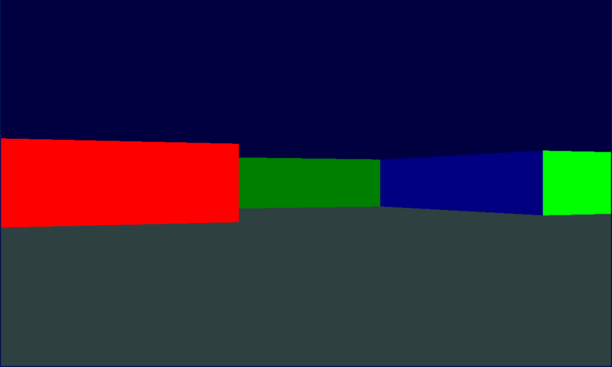
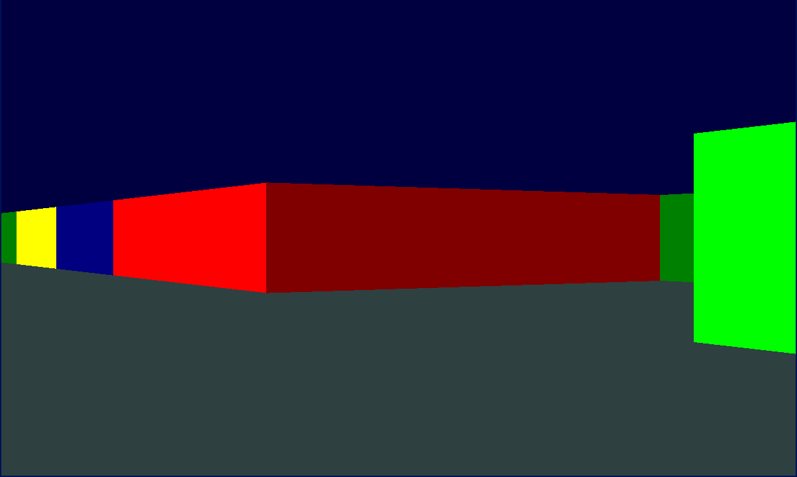
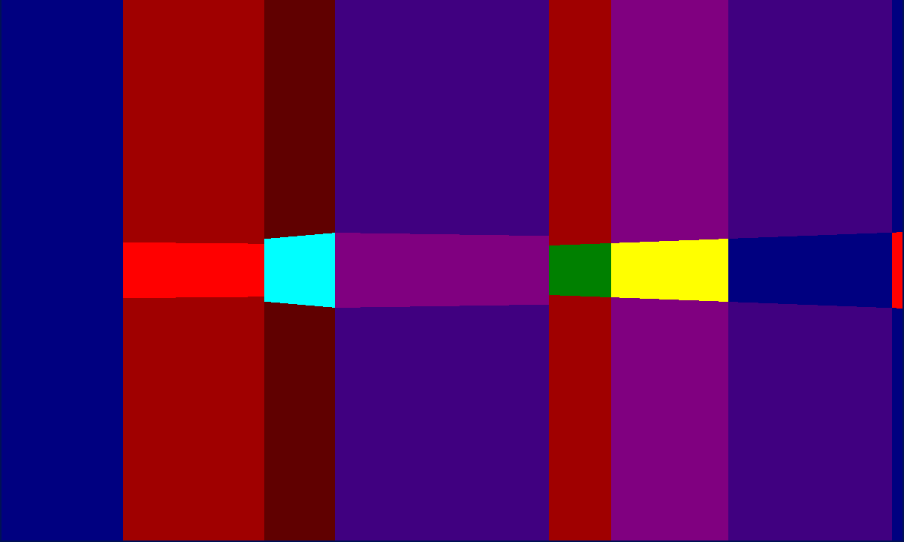

[The last renderer](../part1) worked fine but had 2 major problems, the most apparent is that it can only handle convex geometry, in other works, no walls can overlap on screen.
Another problem is performance, it draws every single wall, regardless of if it is visible or not, resulting in a lot of wasted work (overdraw).

A simple way to solve both at the same time is using portal rendering.
The map is split up into convex sections (I call these rooms), which can be rendered as is, rooms can have also portals that link to another section.
To render a portal, the renderer computes the bounds of the portal, and renders the connected section withing those bounds.
If a portal is not visible on the screen, the connected sector is not rendered, so the engine can avoid rendering a huge amount of geometry.

To do this, store the level geometry as a list of rooms, each with a list of walls.
Each wall can also be a portal, in which case it has to store the index of the linked room. 
I used an integer that is -1 for normal walls to both store if a wall is a portal, and what room it links to.
I also stored the walls as just a list of points, with walls connecting each point with the next one, and the last and first points, to save space and reduce errors inputing data.

```py
struct WallVertex:
	x, y: float
	r, g, b: int
	portal_idx: int # -1 for normal walls

struct Room:
	walls: Array(WallVertex)
	
struct Map:
	 rooms: Array(Room)
```

The room the player is in also has to be known, and this just has to be tracked as the player moves through portals.

The easiest way to implement rendering within bounds is by constraining the x coordinate on screen.
Just wrap the room rendering code into a function that takes the minimum and maximum x coordinate, and don't draw anything outside of those limits.
When drawing a portal, recurse, passing the bounds of the portal as the bounds for the rendering function, limiting the new bounds to be inside of the current bounds.
If a portal is fully outside of the bounds, or the new bounds have 0 (or negative) area, simply don't do anything and move on to the next wall.
(The bounds should be the whole screen with the initial call to the function.)

This is why wall ordering was noted in the last part, by having wall vertexes in a ascending x order as seen from the inside of the room, the portal leading back from the connected room can be ignored, preventing the creation of an infinite loop.
If a portal is being seen from the wrong side, the projected x coordinates will be in the wrong order and can be ignored.

This simple solution quite nicely, this small side room is rendered right regardless of what angle it is looked at:



There is a portal separating the main room from the side room.

It can even handle more complex geometry, like this pillar:

There are a total of 5 portals and 5 rooms visible here, the main room, a side room in front of the pillar, a room the the left and right of the pillar, and one on the far side.  

While it looked nice in those demos, if the floor and ceiling of different rooms are different colors, a flaw is very apperent:


The fix here is to add y axis bounds, but as the intersection of multiple portals can be a complex shape, the easiest way is the create an array of minimum and maximum y pixels for every x coordinate, initialized so that the minimum is 0 and maximum is the screen's height.
For portals, draw the floor and ceiling the same as a normal wall, just skip the actual wall part, updating the y bounds to the area that would be occupied by the wall if it was to be drawn, clamping to within the current bounds.
During drawing of course limit the start and end of the vertical lines (including floor and ceiling) to the y axis bounds.


The current render supports the 3ed dimension awfully little for a 3d renderer, and that will be fixed in part 3.
