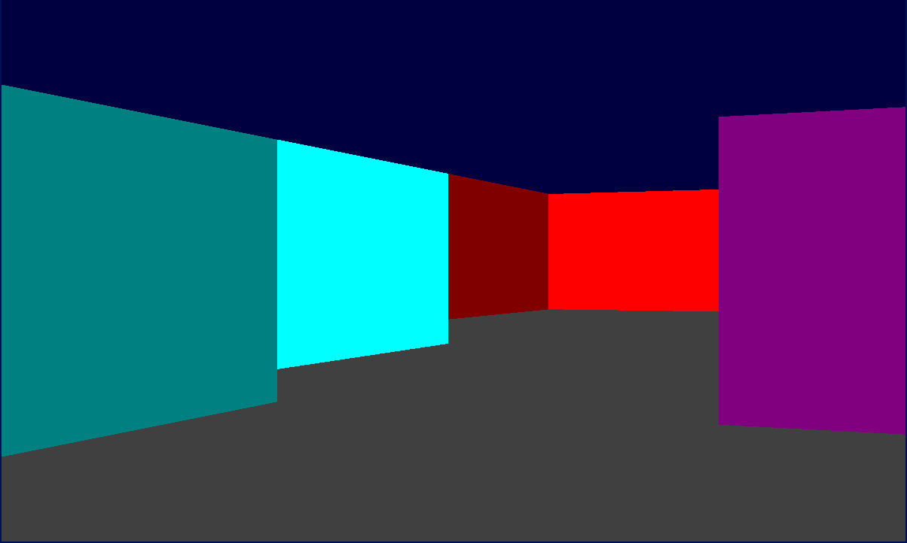
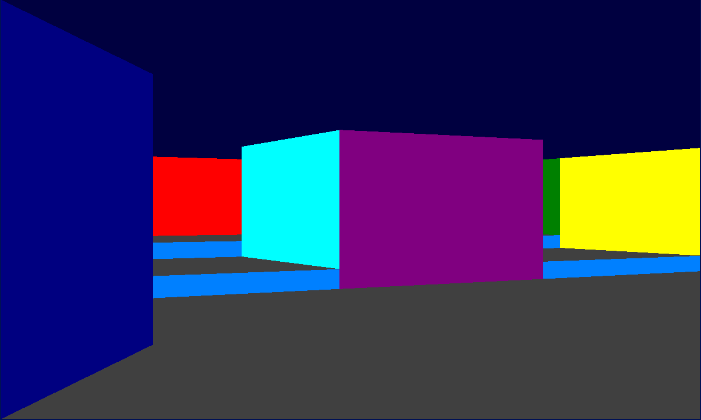

<!--trival change to force rebuild -->

[Currently the render works quite nicely](../part2), but calling it 3d is a bit of a stretch. 
While does provide a first person viewpoint, the entire map is a the same height.
Games with this limitation were, like Wolfenstein 3D, were released and did quite well, but modern audiences want a bit more 3d in their 3d.

The one thing that could really sell this as a 3d renderer would be allowing different wall and ceiling heights, where each room can have different floors and ceiling heights.

To render walls that are not centered on the y axis, the 3d projection code has to take a point on the z axis on the wall, and output a point on the screen's y axis.
It also has to be called twice for each wall endpoint, once for the top and once of the bottom.
The math for this is basically the same as the original:

```py
fov = 0.4

screen_x = rotated.x / rotated.y / fov
screen_y = z / rotated.y / fov
```

To be able to move the camera around on the z axis, just subtract the camera's z from the wall's z before projecting.

Here is the test pillar with with some 3Dness added, the floor gets higher behind the pillar:


The walls look fine but somethings missing on the floor; There is no step between rooms of different heights.

With the added 3rd dimension, portals need more sections, a top, bottom, and center.
The center is rendered as a portal, and the top and bottom sections as a wall.
The height of the bottom section should be the the new floor height minus the current floor height.
The height of the top section should be the old ceiling height minus the new ceiling height.
If one of these are negative, the section should not be rendered.

This requires projecting 4 more points for portals, the start and end of the actual portal (center) area, at each endpoint, then interpolating them for every x to get the start and end y values of the actual portal.
2 additional vertical lines have to be drawn, from the bottom of the ceiling to the top of the center area (top section), and from the bottom of the center area to the start of the floor (bottom section).
The bounds also have to be updated according to the bounds of the center area.



Essentially, what this is doing is rendering 2 walls above and below the portal, if a step is unnecessary.

That's it, a working 3d software renderer.
While not capable of rendering arbitrary 3d geometry, it is actually slightly more capable than the DOOM renderer.

[Here is the code used to render the images, including the renderer, basic (and buggy) movement code, and map loading.](https://github.com/10maurycy10/3d_engine/tree/2ed75fbd396e85dcb48ebaaa3de588889e8fed88)


