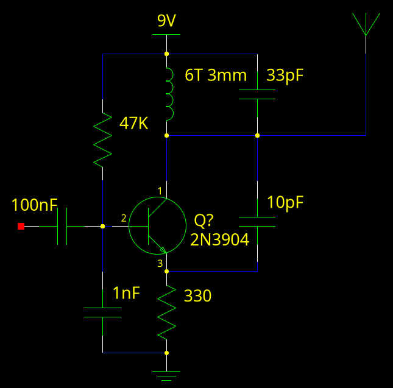

It is surprisingly easy to make a working FM transmitter with just one transistor and a handful of passive components.

This circuit runs best off single 9 volt battery (or another power source with the same voltage), but can function as low as 3v at the cost of output power and range.
The coil should be 6 turns of insulated solid core hook up wire wrapped around a 3mm form (Thinner wire works but allows vibrations to effect it), and the antenna is 30-60cm of wire. 
A 100nF capacitor should be connected across the power supply/battery to improve performance.
When constructing it, almost any method will work, but make sure to keep leads as short as possible, and everything packed as densely as possible.
Strip-boards and solder-less breadboards are not recommended due to the capacitance between strips, but might work.
This circuit draws 2.0 milliamps from a 9v battery and should last for around 100h off a single battery.

When an audio signal, possibly from a headphone output, is connected between ground and the 100nF capacitor, the audio can be head on a nearby FM radio.
The frequency should be adjusted to an empty channel by spreading out/compressing the coil.

# How it works works

This circuit is a VHF colpitts oscillator (with the voltage on the output changing 88 to 108 million times a second), but it is not immediately obvious how the transistors base voltage (with the audio signal coupled in with a 100nF capacitor) creates FM.
One little known fact about BJTs collector base capacitance (due to a reverse biased diode junction) is dependent on the base collector voltage, which is itself dependent on the bias voltage.
Basically, the transistor acts as a small (few pF) voltage controlled capacitor, changing the frequency of the oscillator by ~100kHz.

A receiver isolates a narrow slice (anywhere from 100kHz to 500kHz wide) of frequencies from the signal on the antenna, finds the frequency of the strongest signal in that slice, and then uses that frequency to reconstruct the original audio signal.

# A simple FM bug

The addition of an electret microphone and use of a 9v battery for power turns allows this transmitter to transmit your voice, or any other conversations in a room.
(Note that using such a device to listen in on people without there consent in illegal in all of the US)
This is not very sensitive for a listening device, so it is a good to add a audio amplifier stage:
This circuit draws 2.0 milliamps from a 9v battery and should last for around 100h off a single battery.

Both of these circuits can be built small enough to fit neatly on top of the battery.

# Fox hunting beeper

This is a two (three with the second RF stage describe later) transistor device, that transmits a beeping sound, functioning as a beacon.
The flashing LED can be replaced with a wire, this results in a constant tone.

You might notice that the capacitor values on the oscillator transistor base are different, this recuses coupling because the signal from the oscillator is much stronger than from a microphone.

This circuit draws 2.4 milli amps from a 9v batter and should last for around 100h off a single battery.
With a second RF stage, runs down to 2 volts without the flashing LED.
This should make it possible to power it from 2 AA batteries, or a single 3v coin cell, instead of a 9v battery, as long as the LED is omitted, and at the expense of range.

# Improving range and frequency stability with a class-c amplifier stage

Note: use a 5 pF capactor on the base of the new transistor.

These circuits work, but the frequency changes a lot from something as small as moving your hand next to the antenna, and sometimes the oscillation breaks down entirely.
The solution is another RF stage (this has the added benefit of reducing radiated harmonics):

Keep everything outside of the green box the same as whatever circuit you want to modify.
The new coil can be adjusted to match the transmitters frequency for maximum output, but does not control the frequency.
This addition improves output power (still just a handful of milliwatts), which allows shorter antennas or better range.
This stage has a tiny current cost, less than one milliamps.

# Antenna

Ideally the antenna would be two identical wires, one one the output, and one on the circuits ground (0v line). 
In practice, it still performs well when one side is much sorter than the other. (even just the size of the circuit itself)
If the circuit is mounted in a metal box, take advantage of it by connecting it to the negative side of the battery.

# Maximizing range

Despite having an output of just a few milliwatts, these circuits can achieve an impressive range (>100m) if used on an empty channel with a good receiver, and with good antenna placement. 
[You can use radio-locator](https://radio-locator.com/cgi-bin/vacant) to find the best channel.

To transmit at full power, a few adjustments must be made, these require a field strength meter or a receiver with an signal indicator:

- Some antenna lengths work better than others, try different sizes of antennas or trimming the antenna to find the length for peek output. Just a few centimeters can make a noticeable difference.

- If you have a class-C output stage, it must be tuned to the same frequency as the output. Keep fingers/metallic tools away from the circuit as you take measurements because this will effect tuning.

In my tests on flat ground with obstacles (suburban housing), 50m is common on most frequencies, but more can be achieved on vacant channels.

Another big factor of range is antenna placement and transmitter location. 
VHF propagation mostly line-of-site, so minimizing obstacles between the transmitter and receiver is important. 
Most obstacles are low down, so placing the transmitter high up will make a huge difference, so will raising the receiver, oftentimes just holding it above your head improves things considerably.
Check local topography, even a small hill in the way can kill your signal, but if both the transmitter and receiver on on hill/mountain-tops, the range will be terrific.

# What to do if it does not work.

An excessive antenna can cause the circuit can jump around, transmit very weakly, or not transmit at all.
Cutting the antenna to 10cm is a quick way to check if this is happening.

Another possible issue is if the transmitter falls out of the FM band, this can be checked with an oscilloscope, spectrum analyzer, or frequency counter.
If you don't have any of these tools, check the value of the capacitor across the tuning coil and try adjusting the tuning coil.

# Legality

DISCLAIMER: This section only applies to the US, regulations in other areas may be different.

I am not a lawyer, and this is not legal advice.
Part 15 of the FCC rules allows low power trasmiters in the FM broadcast band from 88 to 108 Mhz (Some other bands also allowed, and some are strictly forbiden, like the aircraft band).
These transmiters are not allowed to interfere with licenced transmitters, but as FM is farly resistant to interference, interference will be minimal.
I would recomend you set the transmitter to a empty part of the band to avoid creating interference and improve range. (other stations can interfere with you).
As long as you don't go outside of the band or transmit with high power, you are not breaking the law.

You can find the full part 15 rules here [ecfr.gov](https://www.ecfr.gov/current/title-47/chapter-I/subchapter-A/part-15).

[The FCC has also released a summary of the the part 15 rules](https://transition.fcc.gov/oet/info/documents/bulletins/oet63/oet63rev.pdf)
