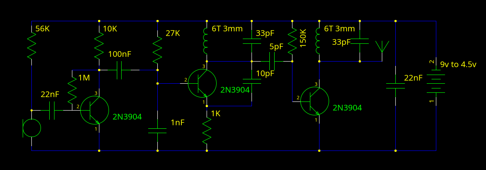
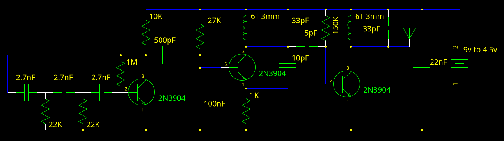

Here are the full schematics for a (slightly improved) FM bug and beacon with a class-C output stage described in the [last post](fun_with_fm_transmiters).

Bug:

Beacon:

The improvements consist of 2 modified resistor values, the emitter resistor on the oscillator stage (Not much power is needed for the output stage), and the bias resistor for the amplifier.

Together these changes allow the device to run 1.5x as long with almost no effect on output power.

# Construction advice

The most important thing is to pack components closely together. 
Perfboards/Matrixboards are a good way to create a compact and resilient layout.

The coils are 6 turns of insulated wire around a 3mm diameter form, and should be adjustable if a trimmer cap is not used. (able to be compressed/stretched out to change frequency).
If a non adjustable coil is used, or more accurate tuning is desired (to hit an empty channel in an area with lots of stations), a variable/trimmer capacitor cab replace the fixed capacitor parallel to the coils.

The antenna should be 10-60 cm of insulated wire. (longer wires may violate the power limit in the US)
If you are using the full 9v, cut the antenna to 7cm in the US to avoid voilating FCC part 15 power requirements.

# Adjustment

First tune a FM radio to an empty channel (failing that, the one with the weakest signal), then adjust the coil (or the capacitor) in the middle of the schematic to set the frequency.
Once it is set right you should hear loud feedback (with the bugs) or a tone in the radio.
The other coil should now be adjusted to get maximum output.

<!--

# Further modifications

Keep in mind that these could put the device over the legal lmit for FM trasmitions without a licence in most locations.
A calibrated feild strenght meter is recomeneded to ensure comliance with local laws.

## Impedence matching

The imedence of the output stage is a few kohms, but the antenna is from ~75 to 50 ohms.
A transformer coupoling the final RF stage to the antenna could increase range substantialy.

## class-E output

Using a class A amp feading a MOSFET trasnstor feading a tuned circut, a class-E (switching) amplifyer can be constructed.
These can acheve efficences of up to 80%

## More voltage

Supplying more volatage to the class-C or class-E output stage will increase output power, but also lossess. Make sure to use power transistors with a heatsink
-->
