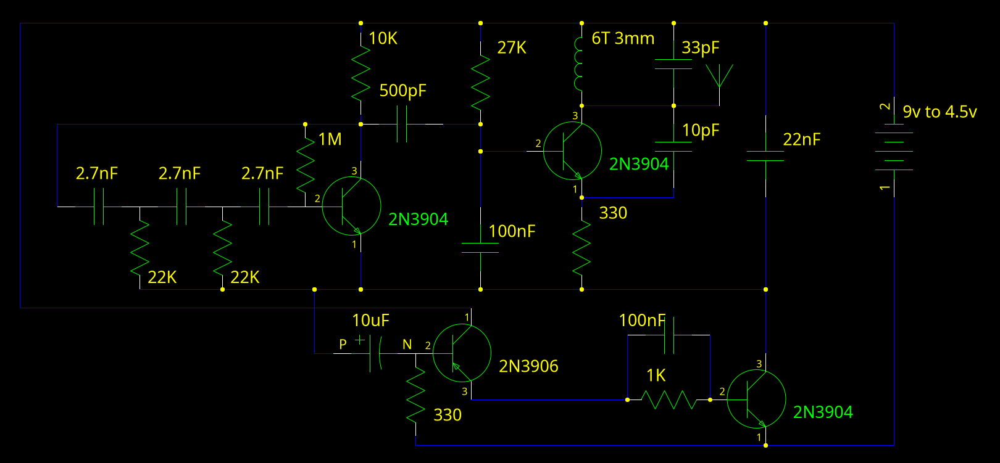

Expanding on the [foxhunt FM transmitter design](../fun_with_fm_transmiters#fox-hunting-beeper), using a pulse generator circuit stolen from [Talking electronics](https://talkingelectronics.com/).
Instead of a continuously running transmitter and audio oscillator modulated with a flashing led, this circuit cuts only sends brief pulses to the audio and RF oscillator, resulting in a dramatic battery life improvement. (~500 hours is possible of a 9 volt)

This circuit can also be expanded with a class-C second stage, giving good range or allowing a shorter antenna.

