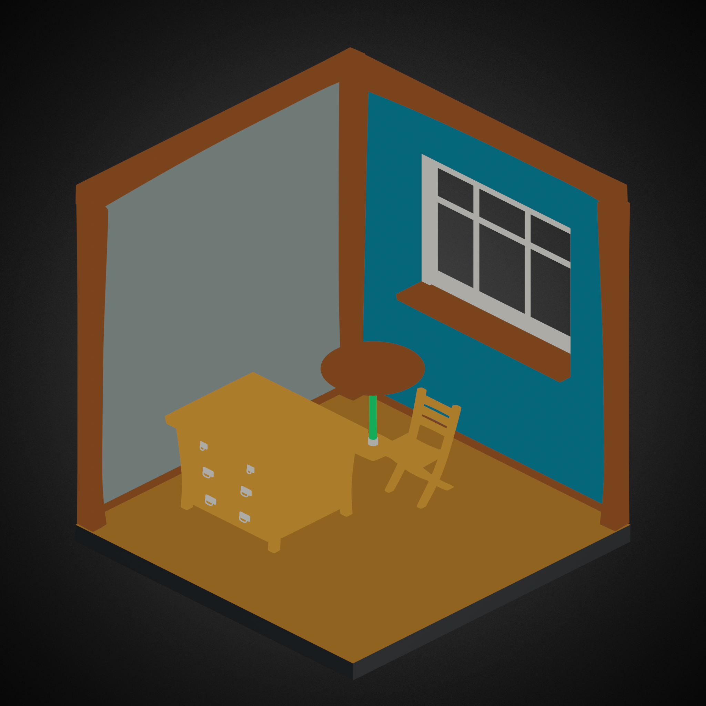
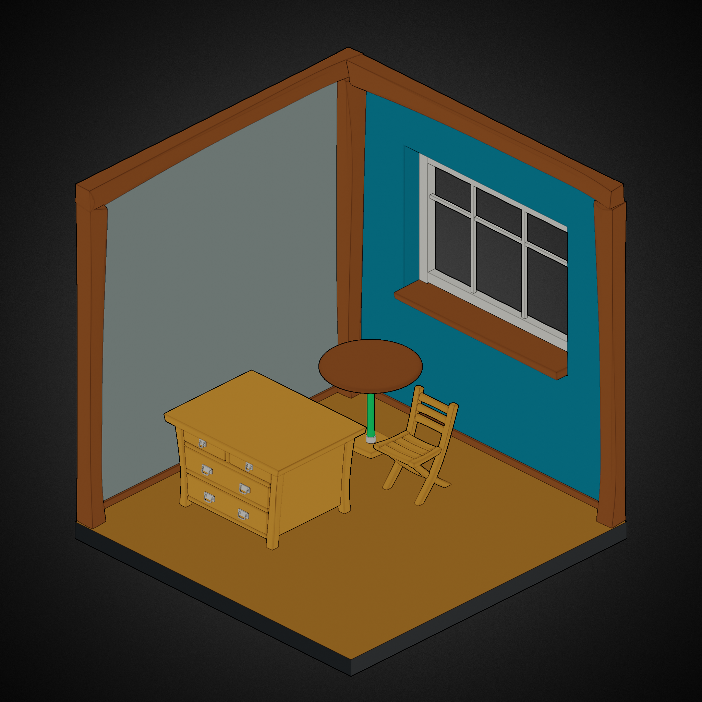
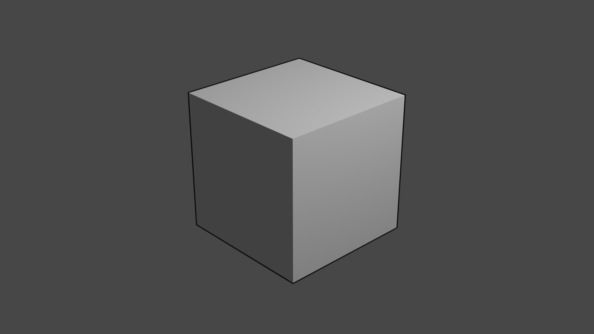
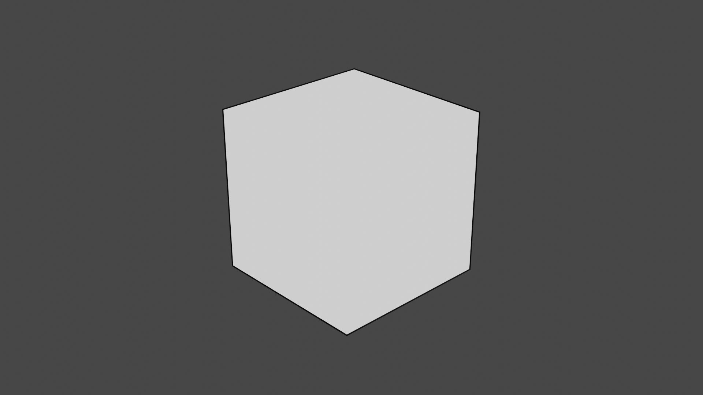
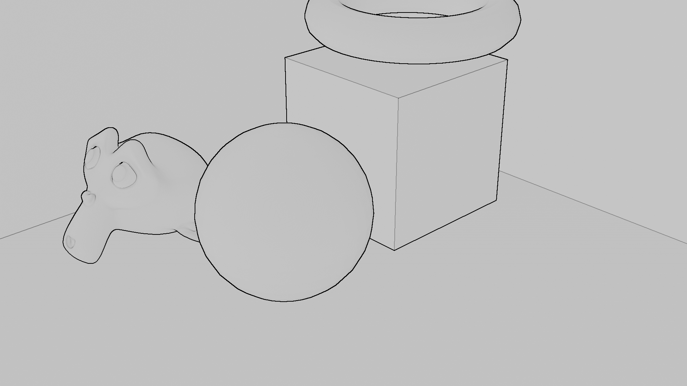
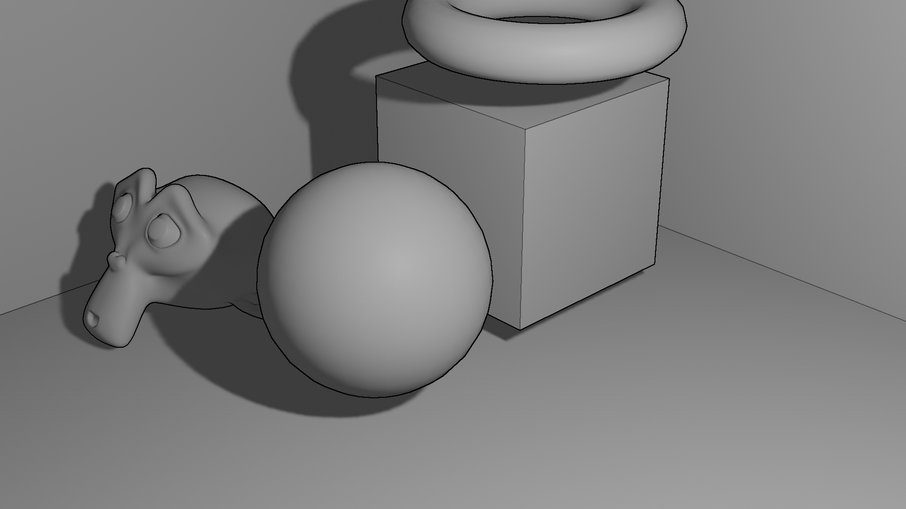
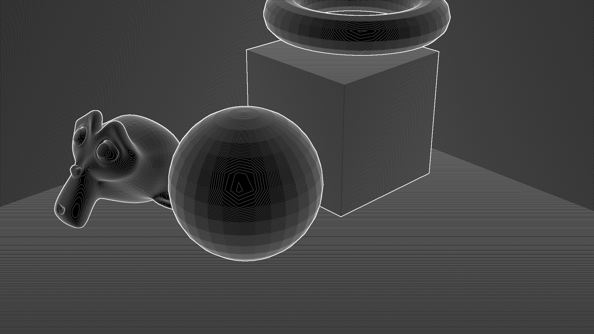
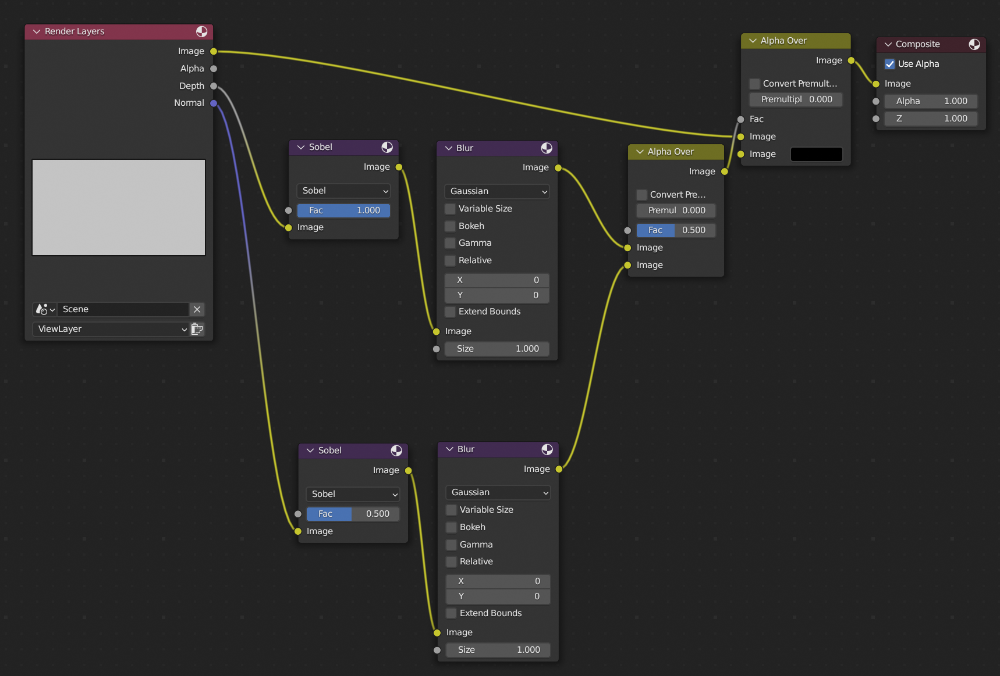

If you want your renderings to look like drawings, the single most important thing is to add outlines.
Even on semi-realistic renderings, outlining can improve clarity.

The differece outlines can make. (slightly modified blender example)

# Inverted Hull

Hull shading involves rendering a slightly larger version of the object, the hull, inside out, and in a different color (usualy black).
Because the vertex order is inverted, backface culling causes only the parts of the hull *behind* the object to be rendered.
This results in an outline around the edges of the object.

To do this in Blender, add a new material to the object (in slot 2), and set the color to the outline color (black for the example).
Then in ``material properties``, make sure to enable ``backface culling`` for the newly added material.
To add the inverted hull, add the solidify modifier on the object, set the material offset (``Materials -> material offset``) on the modifier to 1, and check ``Normals -> Flip`` on the modifier.
Finally set the ``offset`` to 1 (add hull outside of object) and ``thickness`` to 0.05m.

You can adjust the ``thickness`` parameter on the ``solidify modifier`` to change the thickness of the outline.
If you enable ``viewport shading`` you can see the effect of it in the viewport and while you are adjusting the thickness.

One limitation of the inverted hull method is that it only draws outlines behind objects, and not on edges in front of the object, meaning that it still requires shading for more complex geomteties.

Notice the lack of outlining the edges on the front of the cube.

# Edge detection Cel shading

Edge detecton based Cel shading outlines all of an objects edges, making the geometry very visible, even without lighting.

Cel shading, applied on a unlight object.

Cel shading and lighting with blender's Principled BSDF.

Another way to add outlines is to run a sobel filter on the depth and normal maps of the final rendered image, then use that to create the outlines.

To do this in Blender, first, open ``Scene -> Viewlayers`` in the sidebar, then enable the ``Z`` and ``Normal`` passes under ``Data -> Passes``.
This makes the renderer provide the needed data for the outlines.
Then go into the compositing tab and check use nodes.

Create two ``Filter`` nodes, and connect the ``Depth`` and ``Normal`` render layers to the ``Image`` input and set the filter type to ``Sobel``.

The result on running a Sobel filter on the depth pass.

Now pass the image output of the filters into the ``Image`` input of ``Blur`` nodes to smooth out the jagged edges, and increase the size parameter to ``5``.
Then combine the ``Image`` outputs of the ``Blur`` nodes with the ``Image`` inputs of a ``Alpha Over`` Node, and set the Alpha to ``0.5``.
Finally, pass the ``Image`` output of that ``Alpha Over`` node into the ``Alpha`` input of another ``Alpha over`` node, passing the ``Image`` output of the ``Render layers`` node into the first ``Image`` input, and setting the second ``Image`` input to the color you want for the outlines. Pass the ``Image`` output into the ``Image`` input of the composite node and run a render to test it out.

You can adjust the ``Fac`` value on the Sobel filters to adjust where outlines are added.

# Example files

These are simple scenes that demonstrate both methods:

- [Example cel shading](cel.blend)

- [Example inverted hull](hull.blend)

