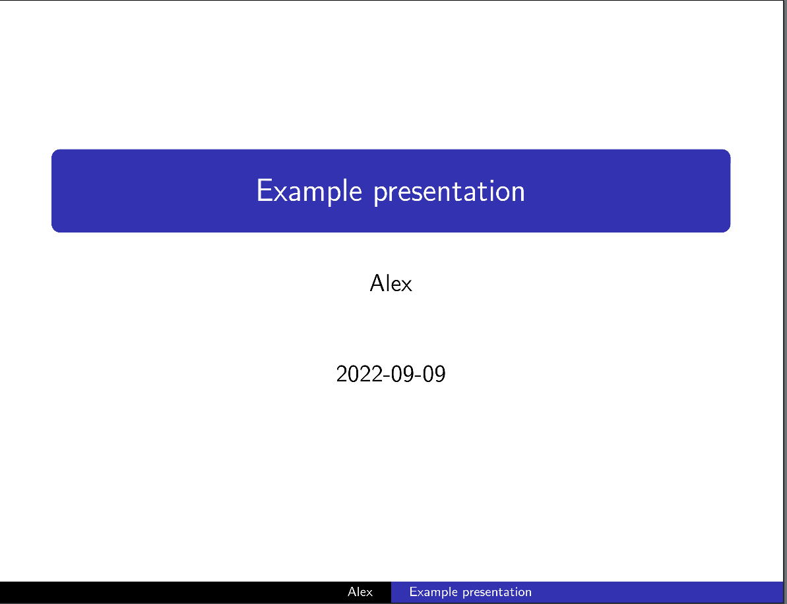
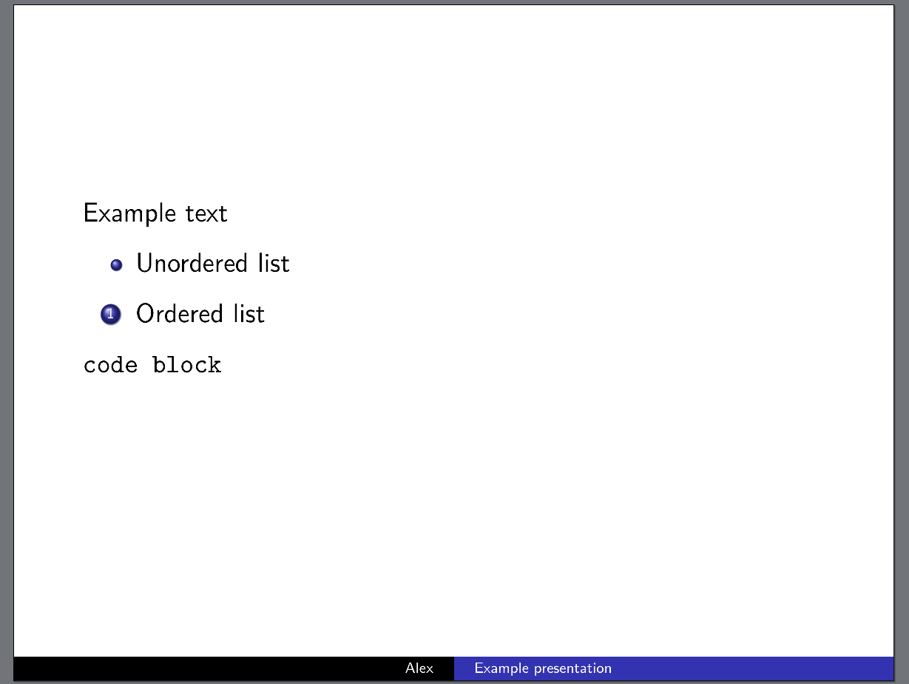

I have often needed to create a presentation, but a graphical tool like LibreOffice Impress is often overkill and inefficient on screenspace.

It turns out, that it is easy to create a presentation in *markdown*, using tools you likely already have installed.

# Pandoc

Pandoc is a document conversion program, that can covert from many markup formats like markdown,latex,troff... to pdf, html, latex,docx...

It turns out pandoc can convert markdown into beamer, a latex based format for presentations. It can also convert beamer into pdf.

This allows converting a markdown file into a pdf presentation in just one command:

```sh
pandoc -t beamer in.md -o out.pdf
```

# Theming

If you try this, you will see that the presentation looks very basic, but this can be fixed with some metadata.

The metadata block at the start of the file is YAML delimited by ``---``.

I like the "Copenhagen" theme, but there are lots of chooses. (Loads of 3d party themes can be found on the internet)

On my system, the themes are stored in ``/usr/share/texmf-dist/tex/latex/beamer/``, named ``beamertheme${NAME}.sty``.

```md
---
title: Example presentation
theme: Copenhagen
author: Alex
date: 2022-09-09
---
```

produces



Quite nice for just some metadata.

# The actual content

Top level sections (lines starting with ``#``) are converted into slides, and anything bellow the heading is inlined into the slide

```md
---
title: Example presentation
theme: Copenhagen
author: Alex
date: 2022-09-09
---

# Example slide

Example text

- Unordered list

1. Ordered list

``code block``
```

produces (excluding the title slide):



Images work as fine, but you may want to add ``{height = 800px}`` (adjust the height as needed) to the images to make them fit on a slide. (or alongside text)

# TLDR

``pandoc -t beamer in.md -o out.pdf`` converts markdown into a presentation.

Make sure to add a block like this the start of the markdown to make the presentation look nice.

```md
---
title: Example presentation
theme: Copenhagen
author: Alex
date: 2022-09-09
---
```
