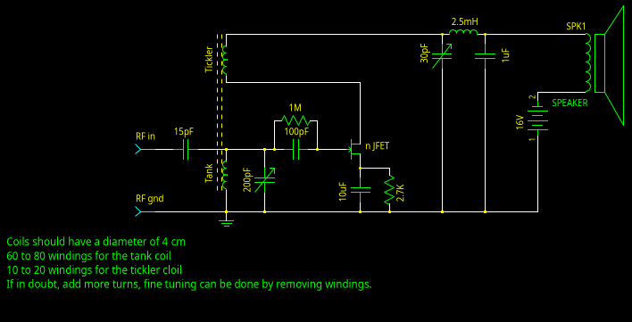

A Crystal radio is a great project, with just a coil of wire, a diode, and a variable capacitor you can build a working AM radio. 
Unfortunately, getting any kind of sensitivity and volume with a Crystal set requires lots of effort and fine tuning, and even then, the sensitivity leaves a lot to be desired.

A simple form of amplified receiver, the regenerative set, requires only a single amplifying element.
Lots of vacuum tube based designs exist, but tubes are hard to buy and very power hungry.

# Part list

- 200 pF variable capacitor. (Get one with a shaft and matching knob if you can)
- 30 pF variable capacitor. (Get one with a shaft and matching knob if you can)
- 15 pF fixed capacitor
- 100 pF fixed capacitor
- 1 uF fixed capacitor
- 10 uF fixed capacitor
- Coil, details on winding it follow
- 2.5 uH choke, hand wound or factory made
- 2.7 KOhm resistor
- 1 MOhm resistor
- High impedance speaker (800 Ohm to 2000 Ohm)
- N type JFET transistor. (such as the J310)
- Source of 16 to 20 volt power (two 9volt batters work well)
- Toggle switch (optional, add between speaker and battery)

(Exact values are not critical, but a large deviation will require fine tuning.)

# Schematic

[GSchem schematic files](regen.sch)

In most variable capacitors, the shaft is connected to one of the terminals, ensure that this is the terminal connected to ground.

Failing to do this will lead to massive hand-capacitance issues.

I recommend adding a empty 2 pin component socket in parallel to the 30 pF variable capacitor, this allows increasing the capacitance (by adding a capacitor) if you have issues getting the set to regenerate.

# The coil

The coil should be wound on a form of around 2in/4.3cm such as a toilet paper roll or PVC pipe.

For the nicest and most compact results, it should be wound with magnet wire, but any fine insulated wire will work.

The tank coil should have around 60-80 turns, and the ticker should have around 10.

# Antenna

The circuit must be grounded, outlet ground works fine.

As an antenna, a length of wire (2-4 m seems to work best) suspended in the air works great. (A finger also works, but this causes hand capacitance problems)

# Fine Tuning

The first thing to adjust is the regeneration: depending on the position of the regeneration control (30 pF capacitor), the radio should ether make a loud squeal or buzzing noise, or be quite. This should happen at all positions of the tuning capacitor (200 pF)

If it always makes noise:

- Try reducing the supply voltage (don't go below 16 V)
- Remove some turns of the regeneration coil

If it is always silent:

- Increase supply voltage (You shouldn't have to go higher than 20 V)
- Add fixed capacitor in parallel with regen control
- Add more turns to regen coil

# Operation

The regen control (30 pF) should be adjusted to be right on the edge of squealing. At this point static should be audible in the speaker.

Now *slowly* sweep through the range of the tuning capacitor (200 pF), while continuing to readjust the regen control. Once you get close to a signal you will hear a single pure tone, continue adjusting the tuning cap so that the frequency of the tone goes down and eventual disappears, being replaced with the transmission.

# Issues with this circuit

- It is not very loud, even when the regen is set high enough that the audio is distorted, the volume is rather quiet. This could be solved by adding an additional audio amplifier. (I will publish an improved set at some point)
- Due to the lack of isolation between the tank circuit and the antenna, this radio does radiate a bit.
- Antenna size and placement effects tuning and regeneration, it is sometimes necessary to add an additional capacitor to get the set to regenerate.
