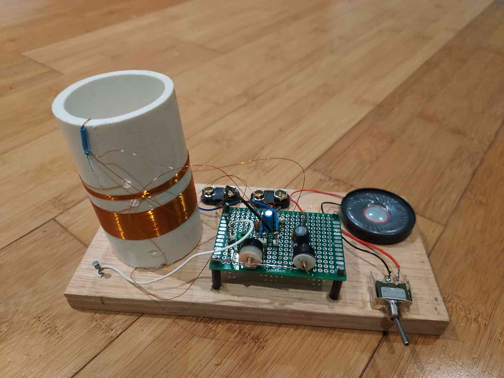

A Crystal radio is a great project, just a coil of wire, diode, and variable capacitor creates a working MW AM radio. 
Unfortunately, even the best crystal radios are not very sensitive, you are unlikely to pick up more then one or two signals.

The regenerative receiver is really just a crystal radio with an amplifier feeding RF back into the tank circuit.
This compensates for lost energy, giving the radio an arbitrarily high Q factor and gain.

# Part list:

- 200 pF variable capacitor.
- 30 pF variable capacitor. This can be replaced with a 30 pF fixed cap, see the coil winding section.
- 15 pF fixed capacitor
- 100 pF fixed capacitor
- 1 uF fixed capacitor
- 10 uF fixed capacitor
- Coils, details on winding them later on.
- 2.5 uH choke, hand wound or factory made.
- 2.7 KOhm resistor
- 1 MOhm resistor
- High impedance speaker (800 Ohm to 2000 Ohm). An old landline telephone works great if you have one, and even turns the radio off when you hang up.
- N-channel JFET transistor. (such as the J310)
- Source of 16 to 20 volt power (two 9 volt batters work)
- Optional toggle switch (wire between speaker and battery)

The exact values are generally not critical, but try to get withing a factor of 2 or so.

# Schematic:

In most variable capacitors, the shaft is connected to one of the terminals, ensure that this is the terminal connected to ground.
Otherwise, the tuning will be affected by hand capacitance, making the radio very hard to use.

# Coil Winding:

The coils should be wound on a form of around 2 in / 4 cm such as a toilet paper roll or PVC pipe.
The tank coil should have around 60-80 turns, and the ticker coil should have around 10.

If the coils are wound on separate forms, the coupling can instead by adjusted by moving the tickler coil toward or away from the tank coil.
In this case you can replace the 30 pF variable capacitor with a fixed one.

# Antenna:

Like a crystal radio, the circuit must be grounded, but the antenna can be a lot shorter.
A few meters of wire suspended in the air is fine.

# Initial adjustments:

The first thing to adjust is the regeneration:
At maximum feedback (fully meshed 30 pF capacitor plates/closest coil position) it should make a squeal or buzzing sound.
At minimum feedback it should stay quiet.

This should be the case at all tuning capacitor (200 pF) positions:
If the receiver is always quiet, try swapping the polarity of the tickler coil and adding more turns to the tickler.
If it is always buzzing, remove turns from the tickler, or reduce supply voltage.

The next thing is frequency, for this it helps to have another AM radio.
Set the circuit maximum feedback, and tune the other radio until you hear the buzzing sound on the other radio.
If you can't hear it, try a different tuning capacitor position (200 pF).

Now change the tuning capacitor to move the signal, and find it again on the other radio.
You should be able move the signal down to the bottom of the band, and right up to the top.

If the radio cannot go up to the top of the broadcast band, reduce the number of turns on the tank coil.
If it cannot go down to the bottom, add extra capacitance in parallel with the tuning capacitor.

If it can't cover the whole range, set it to be able to reach the top, and connect an extra capacitor when tuning lower down stations.

# Operation

The regen control (30 pF) should be adjusted to the point right before the radio squeals. At this point static should be audible in the speaker.

Now *slowly* sweep through the range of the tuning capacitor (200 pF), while continuing to readjust the regen control to maintain the optimal feedback.
Once you get close to a signal you will hear a clean tone, to tune in adjust the tuning cap so that the frequency of the tone goes down and eventual disappears, at which point you will be able to hear the stations audio.

# Issues with this circuit

- It is not very loud, even when the regen is set high enough that the audio is distorted, the volume is rather quiet. This can be solved by adding an additional audio amplifier. 
- If not adjusted correctly, the radio does radiate a bit, but it is not be enough to cause interference.
