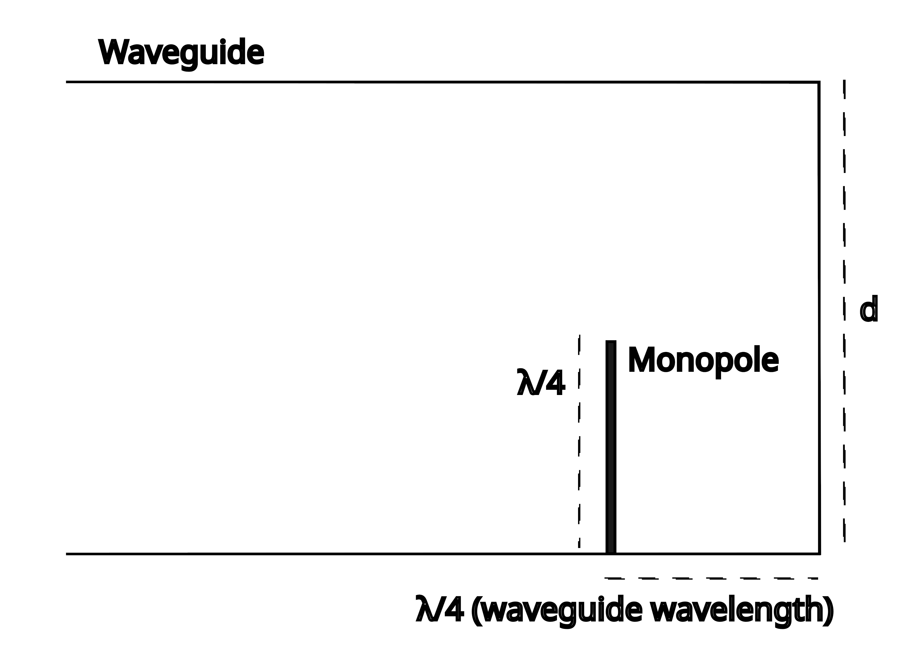

Variations of the "Cantenna" project have been floating around on the internet for a long time (mostly intended for 2.4 GHz WiFi).
However, despite the abundance of calculator tools, there is a lot of conflicting information and very little in the way of explanations.
I will try to explain how they work, the math for designing one, and provide measurements for 2.4 GHz WiFi 5 GHz WiFi, and a correct calculator tool.

A "Cantenna" is a type of Waveguide antenna, a Waveguide is basically a metal tube that functions sort of like an RF hose.
Similar to how sound will travel down a tube, radio waves will travel down a metal tube.
However, Waveguide = RF hose is a bit of an oversimplification, as there a several ways RF can travel down a waveguide, known as modes.
Each mode has its own cutoff frequency's, the maximum and minimum frequency that radiowave have to have to be able to propagate using it.

There a lot of modes but the one that we want for a directional antenna is TE1,1, however we *don't* want the TM0,1 mode to work to ensure all the energy is transferred as TE1,1.

**You don't have to understand all this math, I will provide calculation results for 2.4 GHz and 5 GHz WiFi**

For TE1,1 in a circular waveguide, the frequency must be at a minimum \\( \frac{1.841 c} { \pi d \sqrt{k} } \\), where \\(d\\) is the diameter, \\(c\\) is the speed of light (300 MHz m) and k is the dialectic constant of the material inside the waveguide (for air, this is 1).
For TM0,1, the minimum frequency \\( \frac{2.403 c} { \pi d \sqrt{k} } \\).

Source: "Microwave Engineering" by Pozar

We can use this to compute a diameter range for the antenna for any frequency: 

$$  \frac{1.841  c}{\pi f} < d < \frac{2.403  c}{\pi f} $$

The lower limit is hard, it will not work *at all* with a smaller diameter, the upper limit is less important, the antenna will simply lose some efficiency.
In fact, ideal performance will be at the TM0,1 cutoff, aim there when making/finding a waveguide.

Here is a table of wavelengths and ideal diameters for an antenna for WiFi and a few satellite downlinks (these make great DIY feedhorns for dish antennas).
For wide bands like 5 GHz WiFi, I have used the lower frequency, as these antennas are more effected by being to small than too big
|Use|Frequency|Wavelength (λ)|Min Possible Diameter, use one significantly larger|Ideal Diameter|
|--|--|--|-|-|
|**2.4 GHz WiFi**|2412 MHz|120 mm|73 mm|95 mm|
|**5 GHz WiFi**|5150 MHz|58 mm|34 mm|44 mm|
|GOES 16 downlink|1686.6 MHz|177 mm|104 mm|136 mm|

The length of the antenna is not critical, but a longer antenna will have better directivity, I recommended at least 3/4 wavelength.

To efficiently create a wave in the TE1,1 mode, you need monopole antenna that is a quarter of a wavelength long, and spaced a quarter of a wavelength from the closed end of the can.
The reason for this is that the wave, as it travels towards the closed end, is phase shifted (delayed) by 90 deg (1/4 of a cycle), then the reflection is phase shifted by 180 deg, and finally by another 90 deg during the return trip.
Once the reflected wave reaches the monopole, it is been shifted 360 deg and syncs up with the radiated signal, creating a stronger signal.

<!--
## Impedence conseratons [UPDATE 2023-05]

I haven't realy mentioned Impedence here.
In conventional electronics, Impedence (Z) is how much a component impedes current flow for AC.
Mesured in Ohms(Ω), unlike resistance, it is a complex number, meaning it has two parts, real (in phase current flow, highest at the highest voltage) and imaginary (out of phase current, does not draw power).
Overall impedence is equal to 
For an antenna, we want it to present
-->

## Speed of light in a waveguide

One thing that complicates the math here is that in a waveguide, the *phase velocity* of light is *higher* than the normal speed of light.
Phase velocity is the speed at which a point of constant phase (voltage and magnetic feild) moves in the waveguide.

$$ v_{phase} = \frac{c}{\sqrt(1-(f_{cutoff} / f ))} $$

This means that the optimal place for the monople antenna will be a bit further than half a wavelength outside of the waveguide (in free space).

$$ \lambda_{waveguide} = \frac{c}{f \sqrt(1-(f_{cutoff} / f ))} $$

If f is higher than the cuttoff freqency, for example for a 95mm waveguide at 2410 MHz, then as \\( f_{cuttof} = \frac{1.841 c} { \pi d }\\) for TE1,1, the cuttoff freqency is 1851 GHz.
The means the wavelenth in the guide is *twice* that in free space. This would leads to a 90 degree phase shift between the radated singal and the reflected signal in the antenna, leading to a worse impedence match and less radiated signal.
This needs to be compensated for to get good performance. (You can use the second calculator tool at the bottom)

Side Note: Does this violate the laws of physics? 
No, becuase while the phase velocity is faster than the speed of light, you can't send information any faster than the speed of light.
Similar to how a dot from a laser pointer can "move" faster than the speed of light.
The actual speed of a pulse in a waveguide also depends on the freqency, but is always below c.
This has the intresting side effect that the phases and time of arival of a signal will change as it travels trough a waveguide, this effect is stronger the closer to the cutoff freqency the signal is.
This is called dispersion and can cause problems for wideband signals, and the solution here is build the antenna with a higher diameter, reducing the differences in propigation speed.

# Construction 

Most designs on the internet call for a RF connector and some coax, but If you have a WiFi dongle (this might also work with an SDR) lying around, you can cut off it's internal antenna and solder on the monopole to the output of the dongle.
The ground of the dongle should be connected to the waveguide.
Nearly all dongles use an meandering inverted F antenna, where one side is connected to ground, in the middle there is the RF feed point, and on the other side of the feedpoint is a meandering wire to nowhere.
To connect these to the antenna, cut off the antenna, connect the monopole to the feed point, and the waveguide to the ground connection.
If you get lucky, (The Netgear A6000 has this) the antenna will be a metal strip soldered to the board, but with smaller dongles it is common for the antenna to be a printed circuit board trace, which makes removing the antenna (you only really have to separate the feedpoint from the rest) and connecting it to the monopole will be annoying.

If you use a dongle, it will be annoying to plug it, but this can be fixed by adding a USB cable.
Simply cut one end off, strip off the outer sheath and any foil shielding on the cable, and solder it to the USB contact pads. (In a dongle, the PCB is a part of the USB connector).
The typical right ordering (I would recommended testing with a multimeter, some cables are weird) is, with the pads facing you, from left to right: Black, Green, White, Red.

The antenna can be constructed out of any metal tube (this will be the waveguide) with a closed end, like a opened can (metal lined is ok) at least 1/2 wavelength in length and within the diameter range.
If you can't find a conductive tube, you can wrap a plastic tube in aluminum foil, making sure that the foil is flat to the surface and making a good connection all around, as well as covering the back.
I recommend wrapping more than one turn of foil, and tapeing the turns together, making sure to have foil-foil contact.
Drill a hole 1/4 of a wavelength from the back of the tube, to connect an monopole antenna inside of the waveguide.
To make the actual monopole, cut stiff wire to 1/4 of a wavelength.

Solder the wire to the pin of the connector or the RF output of the dongle, and place it trough the hole, making sure the wire is perpendicular to the waveguide's surface, and *not touching the waveguide* (a bit of heat shrink tubing helps here).
Connect the shield of the RF connector or the ground of the dongle to the waveguide.

# Applications

The antenna is linearly polarized, in the same direction as the monopole is, so try rotating it to improve signal strength, and directional, so it has to be pointed at the other station's antenna to work well.

The antenna can be used as is, as a high gain antenna for wireless networking, Bluetooth (same band as 2.4 GHz WiFi), providing a good 12-14 dB of gain over the stock antenna (25 times more signal!)
With 2 antenna's, facing each other, you can get as good as 28 dB gain (500 times as much signal).

A short one (3/4 wavelength total length) makes a good DIY feedhorn for a a dish antenna, allowing satellite downlinks or insane wireless network range, with just a few milliwatts.

You can also turn one into a horn antenna, by adding a metal horn onto the end of the waveguide.

# Diameter calculator
A
This is a tool for quickly calculating the the waveguide and monopole sizes of the antenna.

 

Enter frequency in MHz (use lowest frequency for large bands): <input id="freq"></input><button onclick='update()'>Calculate</button>



|Parameter|Value|
|-|-|
|Wavelength in free space|
 - 
|
|Length of Monopole|
-
|
|Absolute min diameter, must significantly wider to work well|
-
|
|Ideal diameter, performance falls off after this|
-
|
|Aproximate minimum antenna length|
-
|

# Monopole placement calculator

This will compute the ideal location for the monople antenna

 

Enter frequency in MHz (use lowest frequency for large bands): <input id="freq2"/>, diameter in mm <input id="diam2"/> <button onclick='update2()'>Calculate</button>

<b id="warning"></b>

 

|Parameter|Value|
|-|-|
|TE1,1 cutoff|
 - 
|
|Wavelength in waveguide|
 - 
|
|Quarter Wavelength in waveguide/Optimal monopole spacing from back|
 - 
|
|Min total for good performance|
 - 
|

The monopoles length should be half of the free space wavelength, and never more than half the diameter of the waveguide.

